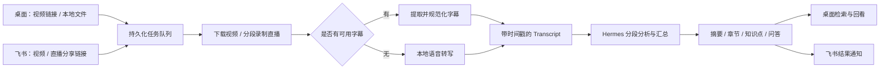

# Video Knowledge Collector

**把视频和直播变成可搜索、可回看、有时间引用的知识。**

Video Knowledge Collector（VKC）是一个 **Windows 优先、本地优先**的视频知识采集项目，作为 **Hermes Desktop 的“视频知识”插件**运行。你可以在桌面端添加视频链接或本地文件，也可以通过飞书机器人提交视频、直播分享链接，让系统完成采集、字幕整理、语音转写和 AI 知识分析。

最终得到的是与原视频关联的 **总结、章节、知识点、建议问答和时间引用**。你可以搜索转写文本、点击时间点回看视频，也可以在飞书接收任务结果。

适用于课程学习、技术分享整理、访谈复盘、产品拆解研究，以及持续记录直播内容。

[功能亮点](#功能亮点) · [支持平台](#支持平台) · [快速开始](#快速开始) · [飞书接入](#飞书接入) · [开源组件](#开源组件) · [开发与文档](#开发与文档)

## 从一个链接到一份知识结果



媒体采集和任务调度由确定性的后台服务执行，Hermes 负责模型调用与知识分析。飞书受理后会返回工作流 ID，长任务在后台继续运行。

## 功能亮点

| 能力 | 可以做什么 |
| --- | --- |
| 多种内容入口 | 桌面粘贴 URL、选择本地视频，或通过飞书提交分享链接；本地导入复制到媒体库，保留原文件 |
| 视频采集 | 探测标题、时长等信息，选择画质、字幕语言和是否自动分析 |
| 直播分段 | 飞书直播默认每 **1 小时**保存一段并自动续录，默认不限制总时长，各片段分别进入分析流程 |
| 字幕优先 | 优先使用平台字幕；支持 SRT、VTT、ASS/SSA、JSON3 等格式，无字幕时自动使用本地 ASR |
| 本地语音转写 | 支持 tiny、base、small、medium、large-v3 模型，以及 CPU / NVIDIA GPU、语言、VAD 和词时间戳配置 |
| 长内容处理 | 分片转写、检查点续跑、分段分析汇总，知识结果关联 Transcript 时间引用 |
| 知识阅读 | 查看版本化摘要、章节、知识点和建议问答，按时间轴或分类浏览，点击引用回看视频 |
| 媒体与文本检索 | 本地媒体库、视频预览、Transcript 全文搜索和字幕时间轴 |
| 任务管理 | 查看进度、阶段、错误和事件，按任务状态暂停、恢复、取消或重试 |
| 飞书交互 | 提交任务、查询状态、取消和重试，向原会话或话题异步发送结果 |
| 系统设置 | 配置媒体存储目录、各平台 Cookies 文件、ASR 参数、分析模型和飞书采集配额 |

### 项目关注的几个细节

- **结果能追溯。** 知识条目带有时间引用，发现疑问时可以回到原视频核对。
- **长任务有状态。** 持久化任务队列、Worker 租约和事件记录让失败可诊断、任务可重试；已完成的转写分片可复用。
- **本地处理与模型分析分工明确。** 视频、字幕、数据库和 ASR 在本机管理；知识分析使用你配置的 Hermes 模型。使用云端模型时，分析所需文本会发送给该提供商。
- **桌面与飞书共用后台。** 在手机发链接，在电脑查看媒体和知识结果，无需维护两套采集程序。
- **模型分别配置。** 知识分析默认继承 Hermes 全局模型，也支持任务级选择；语音转写模型与知识分析大模型相互独立。

## 支持平台

以下是当前 VKC 飞书入口明确接入的平台，不能直接等同于底层下载工具的全部支持列表。

| 内容来源 | 桌面视频采集 | 飞书视频采集 | 飞书直播录制 |
| --- | --- | --- | --- |
| B 站 | 支持 | 支持，含 `b23.tv` 短链 | 支持 `live.bilibili.com/{房间号}` |
| 抖音 | 支持 | 支持，含 `v.douyin.com` 短链 | 支持网页直播间与官方直播分享短链 |
| 小红书 | 支持视频笔记 | 支持，含 `xhslink.cn` / `xhslink.com` 短链 | 支持直播间与官方直播分享短链 |
| 本地视频 | 支持 MP4、MKV、MOV、AVI、WebM 等常见格式 | 不接收本机文件路径 | 不适用 |
| 其他视频站点 | 由当前 yt-dlp 适配能力决定，需实测 | 当前未开放 | 当前未开放 |

抖音、小红书短链接先解析真实目标，再区分点播和直播。直播需处于可访问、已开播状态；下播时保存最后不足一小时的片段。切段或断线重连可能存在短暂间隔，不保证帧级无缝录制。

平台登录状态、接口变化和风控会影响采集。可在系统设置中为对应平台选择 **Netscape 格式的 `cookies.txt`**。抖音移动端直播接口在 Cookies 导致无效响应时，会尝试一次匿名解析，不修改已保存的 Cookies。

当前抖音、小红书直播已通过真实链接解析和短时录制验证；完整一小时录制、分析与飞书回传仍需结合实际任务验证。知识分析主要基于字幕和语音转写，不能替代对画面细节的人工检查；结构化分析失败时会标记兜底结果。

## 快速开始

### 1. 准备环境

当前主要开发和验证环境为 **Windows 10/11 x64 + PowerShell**。

| 依赖 | 要求 / 用途 |
| --- | --- |
| Git | 拉取本仓库及 Hermes 子模块 |
| [uv](https://docs.astral.sh/uv/) | 安装和管理 Python 依赖 |
| Python | 仓库固定使用 3.11；当前 Hermes 声明兼容 `>=3.11,<3.14` |
| Node.js | `22.22.0` 或更新版本 |
| npm | 当前工作区要求 `<11.10.0` 或 `>=11.17.0` |
| [FFmpeg](https://ffmpeg.org/) | 确保 `ffmpeg` 和 `ffprobe` 在 PATH 中 |
| Hermes 模型配置 | 可用的提供商、模型名称及其所需凭据 |

NVIDIA GPU 不是必需条件，ASR 可以使用 CPU。首次安装依赖和下载语音模型需要联网；Windows 依赖同步还可能下载较大的 CUDA 运行库，请预留时间和磁盘空间。

### 2. 获取完整源码

```powershell
git clone --recurse-submodules https://github.com/yknife/video-knowledge-collector.git
cd video-knowledge-collector
```

如果已经克隆过，但 `thirdparty/hermes-agent` 目录为空：

```powershell
git submodule update --init --recursive
```

本项目使用 `yknife/hermes-agent` 的 VKC 集成版本。保持子模块处于主仓库记录的提交，才能获得匹配的桌面界面与后台功能。

### 3. 启动桌面端

在仓库根目录执行：

```powershell
.\scripts\dev.ps1
```

若当前 PowerShell 阻止脚本执行，可仅对这次启动使用：

```powershell
powershell -NoProfile -ExecutionPolicy Bypass -File .\scripts\dev.ps1
```

脚本会同步 Python 依赖、在需要时安装 Node 工作区依赖，然后启动 Hermes Desktop。桌面端负责加载“视频知识”插件、迁移数据库、启动后台 Worker，并提供共享 API。开发模式下请保留启动终端。

### 4. 完成首次配置

1. **Hermes 模型：** 按首次启动引导配置提供商和模型，确认普通对话可用。
2. **媒体目录：** 在“视频知识”的系统设置中选择空间充足的存储位置。
3. **媒体工具：** 在 ASR 设置中确认 FFmpeg、ffprobe、yt-dlp、streamget、faster-whisper 可用。
4. **转写模型：** 可先选择 `small`；CPU 使用 `int8`，GPU 配置按设备检测结果选择。已有可用字幕的视频通常无需 ASR 转写。
5. **平台 Cookies：** 为需要登录或遇到风控的平台选择对应的 `cookies.txt` 文件。

### 5. 分析第一个视频

打开 **视频知识 → 添加内容**，粘贴一个短视频链接并点击“识别链接”；也可以选择“本地视频”，填写标题并选择文件。确认采集、转写和自动分析选项后提交。

在任务中心查看进度，完成后进入媒体详情页：播放视频、搜索 Transcript、阅读知识结果，并点击时间引用核对内容。

首次使用可先验证一个短视频，再尝试长视频或直播。模型下载速度、视频时长、CPU/GPU 性能和所选大模型都会影响处理时间。

## 飞书接入

飞书是可选入口；先完成桌面端首次配置，再接入机器人。

### 配置机器人与网关

1. 在飞书开放平台创建应用并启用机器人，配置收发消息权限，订阅 `im.message.receive_v1` 事件，发布应用版本。
2. 使用长连接（WebSocket）模式，在 Hermes 中配置 App ID、App Secret 和允许访问的用户。完整权限清单见 [Hermes 飞书配置指南](thirdparty/hermes-agent/website/docs/user-guide/messaging/feishu.md)。
3. 在同一个 Hermes profile 的 `.env` 中添加或更新以下配置，再重启相关进程；保留已有模型和机器人配置：

```dotenv
VKC_MESSAGING_INGEST_ENABLED=true
VKC_MESSAGING_MAX_VIDEO_DURATION_SECONDS=0
```

`0` 表示点播及直播总时长不限，飞书直播仍按每小时分段。**配额与时长限制是不同配置**：在系统设置的“飞书采集限额”中，可以启停配额检查、设置每用户/每会话的活跃任务数和每日提交数。

源码运行时，可在仓库根目录的另一个 PowerShell 终端使用项目虚拟环境配置、启动飞书网关：

```powershell
.\thirdparty\hermes-agent\.venv\Scripts\python.exe -m hermes_cli.main gateway setup
.\thirdparty\hermes-agent\.venv\Scripts\python.exe -m hermes_cli.main gateway run
```

桌面端和网关必须使用同一个 Hermes profile；如果该 profile 的网关已运行，无需重复启动。源码开发脚本启动桌面工作区，飞书收发还需要消息网关保持在线。

Windows 桌面默认数据目录为 `%LOCALAPPDATA%\hermes`；自定义 `HERMES_HOME` 或 profile 时以实际配置目录为准。

### 发送任务

将下面的示例地址替换为实际视频或直播链接：

```text
采集并分析这个视频：https://www.bilibili.com/video/实际BV号
录制并分析 https://live.douyin.com/实际直播间ID
刚才的视频处理到哪里了？
取消最新直播任务
重试刚才的视频任务
```

也可以直接发送抖音或小红书直播分享消息。私聊受权限控制；群聊通常需要由已授权用户 @机器人。受理回复包含工作流 ID，结果会异步回传。

若管理员已启用新用户配对，新用户收到验证码后，由管理员在对应 profile 中执行（将 `<验证码>` 替换为实际值）：

```powershell
.\thirdparty\hermes-agent\.venv\Scripts\python.exe -m hermes_cli.main pairing approve feishu "<验证码>"
```

平台说明：[B 站直播](docs/feishu-bilibili-live.md) · [抖音直播](docs/feishu-douyin-live.md) · [小红书直播](docs/feishu-xiaohongshu-live.md)。

## 开源组件

VKC 将以下开源能力组合为视频知识工作流。实际依赖版本以仓库清单和锁文件为准。

| 组件 | 在本项目中的作用 |
| --- | --- |
| [Hermes Agent](https://github.com/NousResearch/hermes-agent) | Agent、模型接入、桌面宿主、消息网关、会话及 profile；本仓库使用 [VKC 集成 fork](https://github.com/yknife/hermes-agent) |
| [yt-dlp](https://github.com/yt-dlp/yt-dlp) | 点播元数据探测、视频与字幕下载 |
| [StreamGet](https://github.com/ihmily/streamget) | 直播平台信息与可录制流解析 |
| [FFmpeg / ffprobe](https://ffmpeg.org/) | 直播录制、音频抽取、媒体信息与文件校验 |
| [faster-whisper](https://github.com/SYSTRAN/faster-whisper) / [CTranslate2](https://github.com/OpenNMT/CTranslate2) | 本地 Whisper 语音转写，支持 CPU 和 GPU |
| [Electron](https://www.electronjs.org/) | 桌面外壳、原生文件选择和应用生命周期 |
| [React](https://react.dev/) / [TypeScript](https://www.typescriptlang.org/) / [Vite](https://vite.dev/) | 工作区界面、类型检查和前端构建 |
| [TanStack Query](https://tanstack.com/query/latest) / [Zustand](https://zustand.docs.pmnd.rs/) | 前端服务端数据缓存与界面状态管理 |
| [SQLite](https://www.sqlite.org/) / [SQLAlchemy](https://www.sqlalchemy.org/) / [Alembic](https://alembic.sqlalchemy.org/) | 本地数据库、全文索引、数据访问与数据库迁移 |
| [Pydantic](https://docs.pydantic.dev/) | 配置、API 数据和结构化知识结果校验 |
| [飞书 Python SDK](https://github.com/larksuite/oapi-sdk-python) | 飞书长连接与消息 API 接入 |

感谢以上项目及其贡献者。各组件许可证以各自仓库和分发文件为准。

## 架构与数据

VKC 以 Hermes 插件交付，桌面端和飞书共用应用服务；不需要另外部署一套 VKC Web 产品。

```text
video-knowledge-collector/
├─ scripts/                         # Windows 启动、校验、RC 构建
├─ docs/                            # 使用说明、设计与项目记忆
└─ thirdparty/hermes-agent/          # 固定提交的 Hermes 集成子模块
   ├─ apps/desktop/src/plugins/video-knowledge/  # 桌面工作区
   ├─ gateway/                     # 共享 API 和消息网关
   └─ plugins/video_knowledge/
      ├─ messaging_tools.py        # 消息采集工具与快速受理
      └─ backend/
         ├─ app/                   # 领域、应用服务、配置和持久化
         ├─ worker/                # 采集、录制、转写与分析任务
         ├─ media_adapters/        # yt-dlp、StreamGet、FFmpeg 适配
         ├─ hermes_client/         # Hermes 模型调用
         ├─ transcript/            # 字幕与 ASR 处理
         ├─ prompts/               # 版本化分析提示词
         └─ migrations/            # 数据库迁移
```

数据库与运行状态按 Hermes profile 隔离，媒体文件写入配置的存储根目录。备份时应同时保留 **Hermes profile 数据和自定义媒体目录**。

公共 API 前缀为 `/api/video-knowledge/v1`，通过 Hermes Gateway 认证访问，例如 `/system/health`、`/media`、`/media/{id}/knowledge`。任务状态统一由状态机更新，并记录持久化事件。

## 常见问题

| 问题 | 检查方向 |
| --- | --- |
| 没有“视频知识”入口 | 确认启动的是本仓库记录的 Hermes 集成版本，且已初始化子模块 |
| FFmpeg 不可用 | 检查 `ffmpeg -version`、`ffprobe -version`；也可配置 `VKC_FFMPEG_PATH`、`VKC_FFPROBE_PATH` |
| 能采集但分析失败 | 检查 Hermes 模型、API 地址、凭据和结构化输出兼容性；在任务中心查看具体错误 |
| 提示登录或平台风控 | 更新对应平台 Cookies 后重试；认证错误不一定表示视频需要付费 |
| 飞书没有回复 | 检查消息网关连接、应用发布与事件权限、用户授权/配对，以及采集入口开关 |
| `Messaging collection quota exceeded` | 查看系统设置中的飞书采集限额和已有活跃任务 |
| 仍提示时长超限 | 检查当前 profile 是否保留旧时长配置；将 `VKC_MESSAGING_MAX_VIDEO_DURATION_SECONDS` 设为 `0` 后重启并重试 |
| 首次启动或转写较慢 | 查看模型下载和任务阶段；较大的语音模型、首次依赖下载及 CPU 转写均可能耗时 |

## 开发与文档

在仓库根目录执行完整验证：

```powershell
.\scripts\check.ps1
```

验证包括 Python 代码检查与测试、飞书/网关回归测试、桌面 TypeScript 检查、插件 lint 和相关前端测试。

构建 Windows 发布候选安装包：

```powershell
powershell -ExecutionPolicy Bypass -File .\scripts\build-rc.ps1
```

默认构建 NSIS，可用 `-Target msi` 或 `-Target all`，输出到 `artifacts/windows-rc`。这是构建入口，不表示仓库当前一定已有可下载的最新安装包。安装包需包含 VKC 集成版本。

| 文档 | 内容 |
| --- | --- |
| [Windows RC 用户手册](docs/windows-rc-user-guide.md) | 安装、升级、数据保留与安装来源验证 |
| [发布清单](docs/windows-rc-release-checklist.md) | 构建与发布验收步骤 |
| [架构说明](docs/architecture.md) | 插件集成和运行边界 |
| [项目记忆](docs/project-memory.md) | 已验证行为、近期修复及已知限制 |
| [飞书闭环设计](docs/feishu-vkc-closed-loop-plan.md) | 消息采集工作流设计及实施阶段 |
| [架构决策](docs/adr) | 关键架构选择及原因 |

部分阶段文档记录的是当时的限制；当前功能与默认行为以本 README 和代码为准。
