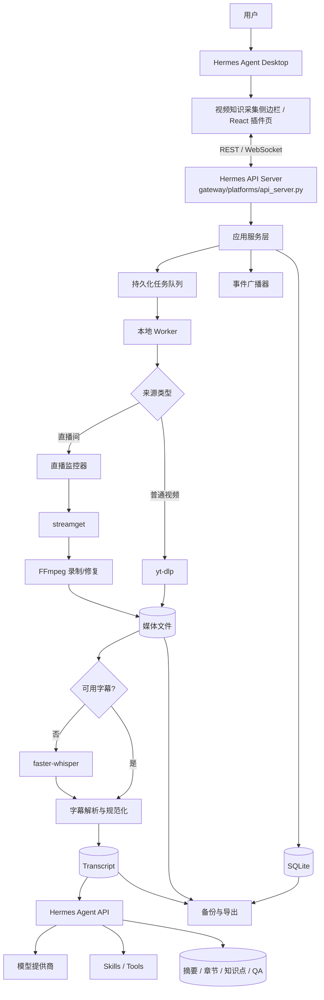
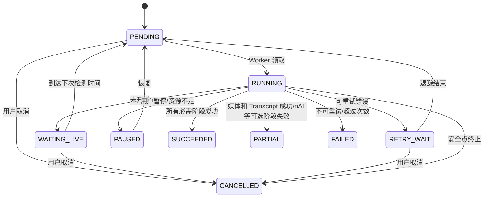
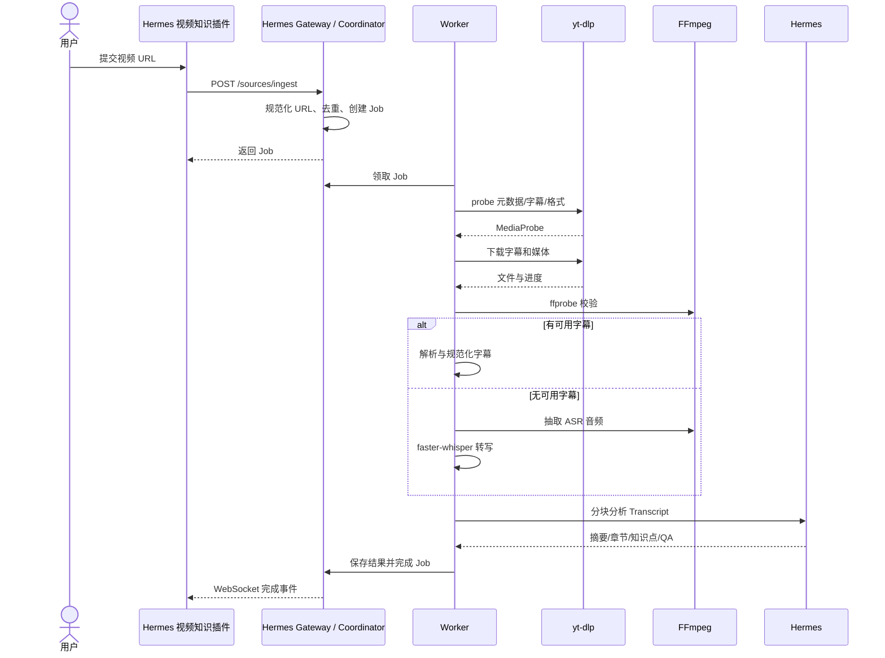

# Video Knowledge Collector 详细设计文档

> 文档版本：v1.1  
> 编制日期：2026-08-19  
> 目标平台：Windows 10/11  
> 技术基线：Hermes Agent Desktop + React + TypeScript + Hermes API Server（aiohttp）+ SQLite + SQLAlchemy  
> 文档定位：用于产品评审、架构评审、任务拆分和 Codex 辅助研发

---

## 1. 文档概述

### 1.1 项目背景

Video Knowledge Collector 是一套面向个人或小团队的视频知识采集系统。系统接收普通视频地址或直播间地址，自动完成媒体采集、字幕提取或语音识别、文本规范化、AI 内容理解和知识沉淀，并对历史内容提供搜索、问答、对比与二次创作能力。

系统不把 Hermes Agent 当作下载器或转码器，而是将其定位为 **AI 编排与知识理解基座**：

- 确定性媒体任务由 yt-dlp、streamget、FFmpeg 和 faster-whisper 完成。
- 业务流程由挂载在 Hermes Gateway 中的应用服务、任务状态机和 Worker 调度。
- 摘要、知识点、章节、QA、跨视频检索与工具调用由 Hermes Agent/LLM 完成。

### 1.2 建设目标

1. 粘贴普通视频 URL 后自动完成下载、转写和 AI 分析。
2. 添加直播间后定时检测开播，自动录制并在结束后处理。
3. 优先复用平台字幕；无可用字幕时调用 faster-whisper。
4. 为每个媒体生成 Transcript、摘要、章节、知识点和建议问答。
5. 支持针对单个视频、指定集合或整个知识库向 Hermes 提问。
6. 支持任务追踪、失败重试、日志查看、配置管理与数据导出。
7. Windows 环境可随 Hermes Agent 一并安装、启动、升级、备份和卸载，用户无需单独启动采集服务。

### 1.3 非目标

- 第一版不建设分布式微服务集群。
- 第一版不支持多人实时协同编辑。
- 不绕过平台登录、付费、DRM 或访问控制。
- 不保证所有网站均可下载；平台适配以 yt-dlp 和 streamget 能力为边界。
- 不在核心业务进程内实现新的音视频编解码器。

### 1.4 设计原则

- **AI 与确定性任务解耦**：下载、录制、转码失败不应由 LLM 猜测处理。
- **可恢复**：每一步都写入持久化状态，进程重启后可恢复或安全重试。
- **幂等**：重复提交同一 URL 或重复执行同一阶段不会产生不可控副作用。
- **本地优先**：默认数据、媒体和模型均可保存在用户本机。
- **接口优先**：前后端、Hermes 和 Worker 之间通过明确契约交互。
- **可观测**：任务、阶段、子进程、重试和 AI 调用均有结构化日志。

---

## 2. 产品范围与用户场景

### 2.1 核心用户

- 需要长期跟踪技术博主、课程或访谈的个人用户。
- 需要采集直播并沉淀内部研究资料的小团队。
- 希望对大量视频做主题检索、观点对比和学习笔记整理的研究者。

### 2.2 典型场景

- 用户粘贴 Bilibili、YouTube 等普通视频地址，等待自动生成摘要。
- 用户登记一个直播间，系统后台定时检查并在开播后录制。
- 用户打开视频详情，按章节查看带时间戳的 Transcript。
- 用户询问：“这个主播最近三次直播对某技术的看法有什么变化？”
- 用户导出 Markdown 学习笔记、字幕文件或结构化 JSON。

### 2.3 MVP 验收目标

- 支持至少一种普通视频平台和一种直播平台的完整闭环。
- 单机任务中断后可以恢复，不重复生成完整媒体文件。
- 1 小时视频可生成带时间戳 Transcript、摘要、章节和知识点。
- Hermes 侧边栏中的视频知识页面可实时看到任务状态和阶段进度。
- Hermes 不可用时，媒体采集与 Transcript 仍可完成，AI 阶段标记为可重试。

---

## 3. 总体架构

### 3.1 逻辑架构



### 3.2 进程架构

Sprint 6 起采用 **Hermes 主应用托管** 的进程模型。用户只启动 Hermes Agent，不再分别启动 Video Knowledge Collector 的 Web 和 API 服务：

| 进程 | 职责 | 故障影响 |
|---|---|---|
| Hermes Desktop + Gateway | 承载 Hermes 主界面、视频知识采集侧边栏插件、统一 HTTP/WebSocket 网关和 Coordinator | 采集入口与新请求暂停；已落盘任务可在下次启动时恢复 |
| Video Knowledge Worker | 执行下载、录制、ASR、AI 任务；由 Hermes 启动流程创建、监控和停止 | 当前阶段中断，可按检查点重试；Hermes 对话能力不应被 Worker 故障拖垮 |

`thirdparty/hermes-agent/plugins/video_knowledge/backend/app` 保存领域服务、应用服务、Repository 和 Schema，不以独立 FastAPI 进程对外监听。采集接口在 `thirdparty/hermes-agent/gateway/platforms/api_server.py` 的统一路由表中注册，并委托给 transport-neutral 的采集应用服务。Hermes Gateway 启动成功后拉起 Worker；退出 Hermes 时先停止领取新任务，再在安全点终止 Worker。禁止再提供要求用户分别启动两个产品的默认运行方式。

### 3.3 部署拓扑

```text
Windows 主机
├─ Hermes Agent Desktop
│  ├─ Hermes UI
│  ├─ Video Knowledge Collector 插件页（侧边栏入口）
│  ├─ Hermes Gateway（唯一监听端口）
│  │  ├─ Hermes /v1、/api 路由
│  │  └─ Video Knowledge /api/video-knowledge/v1 路由
│  └─ 启动并监管 Video Knowledge Worker
├─ Video Knowledge Collector 数据
│  ├─ config\
│  ├─ data\app.db
│  ├─ storage\media\
│  ├─ storage\transcripts\
│  └─ logs\
├─ tools
│  ├─ yt-dlp.exe
│  ├─ ffmpeg.exe / ffprobe.exe
│  └─ 可选的 streamget 运行环境
└─ faster-whisper 模型缓存
```

---

## 4. 技术选型

### 4.1 前端

- React + TypeScript，作为 Hermes Desktop 的 bundled plugin 构建，不再发布独立 Web 应用入口。
- 通过 Hermes `ROUTES_AREA` 注册 `/video-knowledge` 工作区页面，通过 `SIDEBAR_NAV_AREA` 注册“视频知识”侧边栏项。
- 使用 Hermes Plugin SDK、现有组件、布局密度、颜色/圆角/字体和 CSS 主题变量；支持 Hermes 的明暗主题与缩放设置。
- 页面直接渲染在 Hermes workspace 中，不使用 iframe，不复制 Hermes 的导航栏或窗口框架。
- TanStack Query：服务端状态、缓存和请求重试。
- Zustand：少量本地 UI 状态。
- WebSocket：任务状态、日志尾部和直播状态事件。
- 播放器：HTML5 Video；需要 HLS 预览时引入 hls.js。

### 4.2 后端

- Python 3.11 或 3.12。
- Hermes `gateway/platforms/api_server.py`（aiohttp）作为唯一 HTTP/WebSocket 入口，Pydantic v2 负责请求与响应校验。
- `plugins/video_knowledge/backend/app` 中的领域与应用服务保持 Web 框架无关；Gateway handler 只做认证上下文、Schema 转换、调用编排和错误映射。
- SQLAlchemy 2.x + Alembic。
- SQLite，启用 WAL、foreign_keys 和 busy_timeout。
- asyncio 负责 Gateway 与轻量调度；耗时子进程由 Hermes 托管的专用 Worker 管理。
- httpx 访问 Hermes OpenAI-compatible API。
- structlog 或标准 logging JSON Formatter 输出结构化日志。

### 4.3 媒体与 AI

| 能力 | 组件 | 说明 |
|---|---|---|
| 普通视频 | yt-dlp | 元数据、字幕、媒体下载与平台适配 |
| 直播解析 | streamget | 判断开播、解析真实流地址 |
| 录制与转码 | FFmpeg/ffprobe | 录制、封装修复、音频抽取和探测 |
| ASR | faster-whisper | 本地语音识别、VAD、分段与词时间戳 |
| AI 基座 | Hermes Agent | 模型路由、Tools、Skills、Memory 和对话 |
| LLM 接口 | OpenAI-compatible | `/v1/chat/completions` 或 `/v1/responses` |

### 4.4 第一版为何选择 SQLite

单机应用的主要写入来自任务状态与分析结果，SQLite WAL 足以承担 MVP。数据库访问必须集中在 API/Coordinator，Worker 通过明确的 Repository 或短事务访问，避免长事务锁表。未来需要多人或远程部署时迁移 PostgreSQL，业务模型不应依赖 SQLite 特有语法。

---

## 5. 代码目录结构

Sprint 6 完成后，运行时代码全部内聚到 `thirdparty/hermes-agent`。当前交付目录如下；其后的
独立 `apps/packages` 树仅保留为 Sprint 1–5 的历史设计，不再参与运行、测试或发布打包。

```text
thirdparty/hermes-agent/
├─ gateway/platforms/api_server.py             # Hermes/VKC 唯一共享网关
├─ apps/desktop/src/plugins/video-knowledge/   # 侧边栏、路由与完整 React UI
├─ plugins/video_knowledge/
│  ├─ dashboard/                               # Dashboard 插件发现与网关别名
│  └─ backend/
│     ├─ app/                                  # 领域、应用服务、持久化与集成控制器
│     ├─ worker/                               # Hermes 托管的 durable Worker
│     ├─ common/                               # 公共模型与状态机
│     ├─ media_adapters/                       # yt-dlp/FFmpeg/ffprobe 唯一适配层
│     ├─ transcript/                           # 字幕规范化
│     ├─ hermes_client/                        # Hermes 模型调用唯一客户端
│     ├─ migrations/                           # Alembic migrations
│     ├─ prompts/                              # 版本化 AI Prompt
│     └─ config/                               # VKC 配置示例
└─ tests/video_knowledge/                      # 后端与集成测试
```

### 5.1 Sprint 1–5 历史独立目录（已废弃）

```text
video-knowledge-collector/
├─ AGENTS.md
├─ README.md
├─ .env.example
├─ pyproject.toml
├─ package.json
├─ docker-compose.yml                 # 可选开发环境
├─ apps/
│  ├─ api/                              # 无独立监听器；供 Hermes Gateway 调用
│  │  ├─ app/
│  │  │  ├─ bootstrap.py               # DB、迁移、Repository 与应用服务装配
│  │  │  ├─ api/                       # Gateway handler 委托的业务控制器
│  │  │  │  ├─ deps.py
│  │  │  │  └─ v1/
│  │  │  │     ├─ jobs.py
│  │  │  │     ├─ sources.py
│  │  │  │     ├─ media.py
│  │  │  │     ├─ knowledge.py
│  │  │  │     ├─ chat.py
│  │  │  │     ├─ settings.py
│  │  │  │     └─ system.py
│  │  │  ├─ core/
│  │  │  │  ├─ config.py
│  │  │  │  ├─ logging.py
│  │  │  │  ├─ security.py
│  │  │  │  └─ lifecycle.py
│  │  │  ├─ domain/
│  │  │  │  ├─ models.py
│  │  │  │  ├─ enums.py
│  │  │  │  ├─ events.py
│  │  │  │  └─ errors.py
│  │  │  ├─ services/
│  │  │  │  ├─ job_service.py
│  │  │  │  ├─ source_service.py
│  │  │  │  ├─ media_service.py
│  │  │  │  ├─ transcript_service.py
│  │  │  │  ├─ knowledge_service.py
│  │  │  │  └─ chat_service.py
│  │  │  ├─ infrastructure/
│  │  │  │  ├─ db/
│  │  │  │  ├─ repositories/
│  │  │  │  ├─ storage/
│  │  │  │  ├─ websocket/
│  │  │  │  └─ hermes/
│  │  │  └─ schemas/
│  │  └─ tests/
│  ├─ worker/
│  │  ├─ worker/
│  │  │  ├─ main.py
│  │  │  ├─ runner.py
│  │  │  ├─ lease.py
│  │  │  ├─ pipeline.py
│  │  │  └─ stages/
│  │  │     ├─ probe.py
│  │  │     ├─ download.py
│  │  │     ├─ live_monitor.py
│  │  │     ├─ live_record.py
│  │  │     ├─ subtitle.py
│  │  │     ├─ asr.py
│  │  │     ├─ normalize.py
│  │  │     ├─ analyze.py
│  │  │     └─ index.py
│  │  └─ tests/
│  └─ integration/
│     └─ hermes/
│        ├─ lifecycle.py               # Hermes 启停时装配 Coordinator/Worker
│        └─ gateway_handlers.py        # aiohttp 请求/响应适配，不含领域逻辑
├─ thirdparty/hermes-agent/
│  ├─ gateway/platforms/api_server.py  # 注册 /api/video-knowledge/v1 路由
│  └─ apps/desktop/src/plugins/video-knowledge/
│     ├─ plugin.tsx                    # ROUTES_AREA + SIDEBAR_NAV_AREA
│     ├─ api.ts                        # 统一 Gateway 客户端
│     ├─ video-knowledge.css           # 仅补充业务样式，复用 Hermes tokens
│     ├─ features/
│     │  ├─ dashboard/
│     │  ├─ jobs/
│     │  ├─ sources/
│     │  ├─ library/
│     │  ├─ player/
│     │  ├─ transcript/
│     │  ├─ knowledge/
│     │  └─ settings/
│     └─ tests/
├─ packages/
│  ├─ common/                         # Python 公共模型与工具
│  ├─ media-adapters/
│  │  ├─ base.py
│  │  ├─ ytdlp_adapter.py
│  │  ├─ streamget_adapter.py
│  │  └─ ffmpeg_adapter.py
│  ├─ transcript/
│  └─ hermes-client/
├─ migrations/
├─ prompts/
│  ├─ summarize.md
│  ├─ chapters.md
│  ├─ knowledge_points.md
│  └─ suggested_qa.md
├─ skills/
│  └─ video-knowledge/
├─ scripts/
│  ├─ dev.ps1
│  ├─ build.ps1
│  ├─ package.ps1
│  ├─ backup.ps1
│  └─ smoke-test.ps1
├─ config/
│  ├─ default.toml
│  └─ logging.json
├─ storage/                            # 默认 gitignore
└─ docs/
   ├─ architecture.md
   ├─ api.md
   └─ adr/
```

---

## 6. 领域模型与模块设计

### 6.1 核心领域对象

| 对象 | 说明 | 关键属性 |
|---|---|---|
| Source | 普通视频或直播来源 | type、platform、url、external_id、enabled |
| Job | 一次可执行任务 | type、status、stage、progress、attempt |
| JobAttempt | 某次执行尝试 | worker_id、started_at、ended_at、error |
| MediaAsset | 视频、音频、字幕等文件 | kind、path、size、sha256、duration |
| Transcript | 一份规范化转录 | language、source_type、text、version |
| TranscriptSegment | 带时间戳文本片段 | start_ms、end_ms、speaker、text |
| KnowledgeDocument | AI 生成结果 | type、content_json、model、prompt_version |
| Conversation | 用户与 Hermes 的一次对话 | scope、title、created_at |
| Message | 对话消息 | role、content、citations、tool_calls |
| AppSetting | 非敏感配置覆盖 | key、value_json |
| SecretRef | 密钥引用 | provider、secret_name，不存明文 |

### 6.2 Source 模块

职责：规范化 URL、识别平台、维护普通视频和直播订阅、检测重复来源。

关键规则：

- `canonical_url` 去除非必要跟踪参数。
- `platform + external_id` 建唯一索引，获取不到 external_id 时退化为 URL 哈希。
- 普通视频可即时创建 INGEST_VIDEO Job。
- 直播来源可启用/暂停监控并配置轮询间隔、录制时长上限和画质策略。

### 6.3 Job 模块

职责：任务创建、状态迁移、租约、取消、重试、进度、事件和恢复。

关键规则：

- 只有状态机服务可以修改 Job 状态。
- Worker 领取任务时设置 `lease_owner` 与 `lease_expires_at`。
- 长任务周期续租；租约超时的 RUNNING 任务由恢复器转为 RETRY_WAIT。
- 取消为协作式：写入 `cancel_requested_at`，Worker 在安全点终止子进程。
- 阶段输出先写临时文件，成功后原子重命名并登记 MediaAsset。

### 6.4 Media 模块

职责：调用工具、管理媒体文件、探测格式、校验完整性和清理临时文件。

适配器接口建议：

```python
class VideoDownloader(Protocol):
    async def probe(self, url: str, options: ProbeOptions) -> MediaProbe: ...
    async def download(self, request: DownloadRequest, events: EventSink) -> DownloadResult: ...


class LiveResolver(Protocol):
    async def get_status(self, url: str) -> LiveStatus: ...
    async def resolve_stream(self, url: str, quality: str) -> StreamInfo: ...


class Recorder(Protocol):
    async def record(
        self, stream: StreamInfo, target: Path, control: ControlToken
    ) -> RecordResult: ...
```

### 6.5 Transcript 模块

职责：字幕选择、格式解析、ASR、分段清洗、合并和版本管理。

统一中间格式：

```json
{
  "language": "zh-CN",
  "source_type": "subtitle",
  "segments": [
    {
      "index": 0,
      "start_ms": 1200,
      "end_ms": 4320,
      "speaker": null,
      "text": "这里是规范化后的字幕文本",
      "confidence": null
    }
  ]
}
```

### 6.6 Knowledge 模块

职责：切块、调用 Hermes、校验结构化输出、合并分块结果、管理 Prompt 版本和重新分析。

生成类型：

- `summary_short`：100-300 字摘要。
- `summary_long`：结构化详细摘要。
- `chapters`：标题、起止时间、摘要。
- `knowledge_points`：概念、观点、论据、行动项。
- `suggested_qa`：问题、答案、引用片段与时间范围。
- `entities`：人名、组织、产品和主题标签。

---

## 7. 任务状态机

### 7.1 状态定义

| 状态 | 含义 | 是否终态 |
|---|---|---|
| PENDING | 已创建，等待领取 | 否 |
| RUNNING | Worker 正在执行 | 否 |
| WAITING_LIVE | 直播未开播，等待下次检测 | 否 |
| RETRY_WAIT | 可重试失败，等待退避结束 | 否 |
| PAUSED | 用户暂停或系统条件不满足 | 否 |
| SUCCEEDED | 所有必需阶段成功 | 是 |
| PARTIAL | 核心产物成功，非核心阶段失败 | 是 |
| FAILED | 不可恢复或超过重试次数 | 是 |
| CANCELLED | 用户取消 | 是 |

### 7.2 阶段定义

```text
CREATED
→ PROBING
→ ACQUIRING_MEDIA / MONITORING_LIVE / RECORDING
→ VERIFYING_MEDIA
→ ACQUIRING_SUBTITLE
→ TRANSCRIBING（仅无字幕时）
→ NORMALIZING_TRANSCRIPT
→ ANALYZING
→ INDEXING
→ FINALIZING
→ DONE
```

### 7.3 状态迁移图



### 7.4 迁移约束

- 终态默认不可直接恢复；“重试”应创建新 attempt 并将 Job 迁回 PENDING。
- `progress` 只能在 0-100 内单调增加；重试阶段可重置阶段进度，但保留总历史。
- 每次迁移写入 `job_events`，包含 from、to、stage、reason 和 actor。
- PARTIAL 的最低条件是 Transcript 可用；只有媒体但无 Transcript 应视业务策略为 FAILED 或 PAUSED。

### 7.5 重试策略

默认指数退避：`delay = min(base * 2^(attempt-1) + jitter, max_delay)`。

| 错误类别 | 默认次数 | 初始等待 | 说明 |
|---|---:|---:|---|
| NETWORK_TIMEOUT | 5 | 15 秒 | 网络抖动、连接超时 |
| RATE_LIMITED | 6 | 60 秒 | 尊重 Retry-After |
| LIVE_OFFLINE | 无限调度 | 60-300 秒 | 不是错误，进入 WAITING_LIVE |
| TOOL_CRASH | 3 | 30 秒 | 子进程异常退出 |
| AUTH_REQUIRED | 0 | - | 暂停并提示用户更新凭证 |
| UNSUPPORTED_URL | 0 | - | 直接失败 |
| DISK_FULL | 0 | - | 暂停所有采集任务 |
| HERMES_UNAVAILABLE | 5 | 30 秒 | 可形成 PARTIAL 后单独重跑 AI |

---

## 8. 普通视频处理流程

### 8.1 主流程



### 8.2 URL 探测

调用 yt-dlp 的 JSON 输出能力获取：标题、作者、平台 ID、时长、发布时间、缩略图、字幕清单、自动字幕清单和格式清单。探测阶段不得下载完整媒体。

建议将命令执行封装在 `YtDlpAdapter` 内，业务层只接收结构化结果。不得将用户输入直接拼入 shell 字符串；使用参数数组启动进程。

### 8.3 格式选择

默认策略：

1. 优先选择不高于用户配置上限的最佳视频与音频。
2. 知识提取场景默认 1080p 上限，避免无意义占用磁盘。
3. 用户选择“仅音频”时不保存视频轨。
4. 输出优先 MP4/M4A；必要时由 FFmpeg 无损重封装。
5. 保存 yt-dlp 原始 info JSON，便于追踪来源和重新处理。

### 8.4 Cookie 与认证

- 支持用户配置 Netscape `cookies.txt` 路径。
- `--cookies-from-browser` 作为可选高级能力，不作为 Windows 默认方案。
- 日志不得输出 Cookie 内容、完整请求头或授权令牌。
- 认证失败转为 AUTH_REQUIRED，暂停任务并给出可操作提示。

### 8.5 去重策略

- Source 层：`platform + external_id` 去重。
- Media 层：对完成文件计算 SHA-256；大文件可先使用 size + partial hash，后台补齐完整哈希。
- 用户重复提交时可选择“打开已有记录”或“重新分析”，默认不重复下载。

---

## 9. 直播监控与录制

### 9.1 监控模型

每个 Live Source 包含：

- `enabled`：是否启用监控。
- `poll_interval_seconds`：轮询间隔。
- `quality_policy`：原画/指定清晰度/自动。
- `recording_max_seconds`：单次录制上限。
- `schedule_json`：可选监控时间窗。
- `last_live_session_key`：防止同一场直播重复启动。

### 9.2 开播判断

streamget 适配器返回统一 `LiveStatus`：

```json
{
  "is_live": true,
  "session_key": "platform-room-start-time",
  "title": "直播标题",
  "anchor": "主播名",
  "started_at": "2026-08-16T20:00:00+08:00",
  "streams": [
    {"quality": "1080p", "url": "redacted", "expires_at": null}
  ]
}
```

`session_key` 必须尽可能稳定。若平台无法提供场次 ID，可使用房间 ID、推断开播时间和标题哈希组合。

### 9.3 录制流程

1. Monitor 到期后查询直播状态。
2. 未开播：更新 `next_run_at`，进入 WAITING_LIVE。
3. 已开播且场次未录制：创建 RECORD_LIVE Job。
4. 解析目标清晰度流地址，启动 FFmpeg。
5. 定期记录文件大小、录制时长、FFmpeg 统计信息并续租。
6. 检测正常下播、用户取消、超时或流断开。
7. 对输出文件执行 ffprobe 校验和必要的封装修复。
8. 将有效片段登记为 MediaAsset，进入字幕/ASR 阶段。

### 9.4 FFmpeg 建议

- 首选写入 `.ts` 或 `.mkv.part` 等对异常中断更耐受的容器。
- 录制结束后重封装为 `.mp4` 或 `.mkv` 正式文件。
- 子进程 stdout/stderr 分行读取，提取 `out_time_ms`、`total_size` 和 `speed`。
- Windows 取消时先发送可控终止信号；超时后再强制结束进程树。
- 每 5-10 分钟写一次检查点，必要时允许多分片录制后合并。

### 9.5 断流策略

- 短暂断流：最多快速重连 3 次，继续同一场次并生成新分片。
- 长时间断流：等待宽限期，例如 120 秒；仍无法恢复则结束场次。
- 多分片均保留原始文件，生成逻辑合并记录；合并失败不删除原分片。
- 最终 Transcript 可跨分片连续编号，并保留来源分片引用。

---

## 10. 字幕与 ASR 设计

### 10.1 字幕优先级

1. 用户指定语言的人工字幕。
2. 视频主要语言的人工字幕。
3. 用户指定语言的自动字幕。
4. 其他可接受语言字幕。
5. 无可用字幕时执行 faster-whisper。

“可用”需同时满足：文件可解析、至少有一个非空段、覆盖时长达到阈值、语言符合策略、乱码率低于阈值。

### 10.2 支持格式

第一版支持 SRT、VTT、ASS/SSA 和 yt-dlp JSON3。所有格式转换为统一 Segment。保留原字幕文件，不直接覆盖。

### 10.3 规范化规则

- 统一时间为毫秒整数。
- 清理 HTML 标签、样式控制符和重复空白。
- 合并相邻、内容相同或高度重叠的自动字幕。
- 不擅自改写专有名词；文本纠错属于可选 AI 后处理并保留版本。
- 段落合并时设置最大持续时间和最大字符数。
- 保存原始 Transcript 与规范化 Transcript 的版本关系。

### 10.4 faster-whisper Pipeline

1. FFmpeg 抽取 16 kHz、单声道 PCM/WAV 或模型适配音频。
2. 可选 VAD 过滤长静音。
3. 根据 GPU/CPU 配置选择模型、compute type 和 batch size。
4. 以片段级时间戳为默认；需要精细引用时启用词级时间戳。
5. 结果通过相同 Transcript Normalizer。
6. 记录模型名、模型版本、设备、compute type、语言和参数。

默认配置建议：

| 场景 | 模型建议 | compute type | 备注 |
|---|---|---|---|
| CPU 快速 | small/medium | int8 | 兼顾速度与准确率 |
| NVIDIA GPU | medium/large-v3 | float16 | 视显存调整 batch |
| 高质量离线 | large-v3 | float16/int8_float16 | 允许更长处理时间 |

### 10.5 超长内容切分

ASR 层按音频分片处理，但 Transcript 合并后保持全局时间轴。分片边界保留 1-2 秒重叠，并用文本相似度与时间重叠去重。

---

## 11. Hermes Agent 集成

### 11.1 集成边界

Hermes 负责：

- 调用底层 LLM 并统一模型提供商。
- 执行 Video Knowledge Skills/Tools。
- 按对话范围进行问答与工具编排。
- 在允许时使用 Memory 记住用户偏好。

业务后端负责：

- 权限、任务状态、数据存储和文件访问。
- Transcript 切块、上下文预算和结果校验。
- 为 Hermes 提供受控业务 Tools，而不是开放数据库和文件系统。

### 11.2 Hermes 托管启动与停止

Hermes Agent 是唯一的用户启动入口。Desktop 启动阶段确保 `api_server` platform 已启用，并按以下顺序拉起视频知识采集能力：

1. Hermes Gateway 创建 `APIServerAdapter`，加载 Video Knowledge 配置。
2. 执行存储路径校验、数据库备份与 Alembic migration，装配 Coordinator、Repository 和事件广播器。
3. 在 `gateway/platforms/api_server.py` 注册采集路由后开始监听统一端口。
4. 使用参数数组启动 Video Knowledge Worker 子进程，禁止 `shell=True`；注入 storage root、Gateway 地址和密钥引用，不在命令行或日志中暴露密钥值。
5. 等待 Worker 首次心跳后将 `video_knowledge` 健康状态标记为 `ready`；超时则标记为 `degraded`，Hermes 主体继续可用，侧边栏提供诊断与重试入口。

Hermes 退出时，Gateway 先拒绝新的采集任务并通知 Worker 在安全点停止，等待有限的优雅退出时间后再终止受控进程树。未完成 Job 依靠租约与检查点在下次 Hermes 启动时恢复。Worker 意外退出时由 Hermes 内的 supervisor 按退避策略重启；短时间连续失败达到阈值后停止重启并显示故障状态，避免无限拉起。

### 11.3 共用 Gateway 与 API 挂载

Video Knowledge Collector 不监听独立 HTTP 端口。`gateway/platforms/api_server.py` 的 `APIServerAdapter._http_route_table()` 注册 `/api/video-knowledge/v1/*` 路由，具体 handler 位于采集集成层并委托 `plugins/video_knowledge/backend/app` 的应用服务。这样可以保持接口确实挂载在 Hermes API Server，同时避免把领域逻辑堆入 Hermes 路由文件。

采集路由必须复用 Hermes Gateway 的 Bearer 认证机制，以及 body limit、CORS、security headers、request/profile 上下文和错误审计。开启 profile multiplex 时自动支持 `/p/{profile}/api/video-knowledge/v1/*` 镜像；数据库与存储根目录按明确的 Hermes profile 隔离。不得通过反向代理转发到另一个本地 FastAPI 监听器，也不得为采集服务分配第二套 API key。

### 11.4 Hermes 侧边栏与视觉集成

Video Knowledge Collector 作为默认启用的 Hermes Desktop bundled plugin：

- 在 `ROUTES_AREA` 注册 `/video-knowledge` 全页工作区，在 `SIDEBAR_NAV_AREA` 注册“视频知识”入口；点击后在 Hermes 主 workspace 内切换。
- 不使用 iframe 或另开浏览器窗口；不重复实现标题栏、侧边栏、设置外壳和全局快捷键。
- 优先使用 `@hermes/plugin-sdk` 暴露的组件、Codicon、Tip、Query、导航和存储能力；业务 CSS 只补充媒体播放器、Transcript 时间轴等 Hermes 尚无的组件。
- 颜色、背景、边框、字体、间距、圆角、hover/focus/disabled 状态全部引用 Hermes CSS tokens，并跟随明暗主题、透明度和缩放设置。
- 加载、空状态、错误提示、Toast、对话框和表格密度与 Hermes 现有页面保持一致；不得引入 Ant Design 等会形成第二套视觉语言的全局组件库。
- 侧边栏可显示运行中任务数量与降级状态；Worker 故障只影响插件能力，不阻断 Hermes 聊天和其他插件。

### 11.5 Hermes Client 配置

```toml
[hermes]
base_url = "http://127.0.0.1:8642/v1"
api_mode = "responses"                 # responses | chat_completions
model = "configured-in-hermes"
timeout_seconds = 180
max_retries = 3
stream = true
api_key_secret = "api_server_key"      # 与 Hermes Gateway 共用密钥引用
```

Worker 通过同一 Hermes Gateway 调用 AI 接口。实际 host、port、profile prefix 和密钥引用由 Hermes 启动器注入，不要求用户为采集服务重复配置模型提供商或凭证。

### 11.6 分块与汇总

长 Transcript 采用 Map-Reduce：

1. 按章节候选、停顿和 token 上限切块，保留时间范围。
2. Map 阶段为每块提取摘要、主题、事实、观点、行动项和候选章节。
3. Reduce 阶段基于 Map 结果生成全局摘要、知识点、章节和 QA。
4. 每个结论携带 `segment_ids` 或时间范围，支持回跳原视频。
5. 结构化输出通过 Pydantic/JSON Schema 校验；失败时只重试当前 AI 子任务。

### 11.7 AI 输出契约示例

```json
{
  "summary": "...",
  "chapters": [
    {
      "title": "章节标题",
      "start_ms": 120000,
      "end_ms": 420000,
      "summary": "...",
      "segment_ids": [120, 121, 122]
    }
  ],
  "knowledge_points": [
    {
      "type": "claim",
      "title": "知识点",
      "content": "...",
      "confidence": 0.82,
      "segment_ids": [135, 136]
    }
  ],
  "suggested_qa": [
    {
      "question": "...",
      "answer": "...",
      "segment_ids": [135, 136]
    }
  ]
}
```

### 11.8 Prompt 管理

- Prompt 作为版本化文件存放在 `prompts/`。
- 每个 KnowledgeDocument 记录 `prompt_name`、`prompt_version`、`model` 和参数。
- Prompt 内容变更必须更新版本并通过固定样例回归测试。
- 系统提示明确要求：只基于给定材料回答；无法确认时输出“不足以判断”。

### 11.9 流式问答

前端调用 `/api/video-knowledge/v1/conversations/{id}/messages`，Gateway handler 再流式访问同一 Hermes Agent runtime。后端将 token、tool_call、citation、done 和 error 事件转换为统一 WebSocket/SSE 事件。对话中引用片段必须包含 media_id、segment_id、start_ms 和 end_ms。

---

## 12. Hermes Skills 与 Tools

### 12.1 Skill：video-knowledge

建议提供一个领域 Skill，向 Hermes 描述：

- 知识库的概念与可用工具。
- 搜索后必须读取具体 Transcript 片段再回答。
- 涉及跨视频比较时应先确定范围和时间。
- 回答事实性问题必须带时间戳引用。
- 不得直接访问任意本地路径。

### 12.2 Tool 清单

| Tool | 输入 | 输出 | 权限 |
|---|---|---|---|
| `search_videos` | query、source_ids、date_range、limit | 视频与匹配摘要 | 只读 |
| `search_transcript` | query、media_ids、top_k | 带分数的片段 | 只读 |
| `get_transcript_segments` | media_id、segment_ids/时间范围 | 原始片段 | 只读 |
| `get_video_metadata` | media_id | 标题、作者、时长、来源 | 只读 |
| `get_knowledge_document` | media_id、type | 已生成知识文档 | 只读 |
| `compare_videos` | media_ids、dimensions | 对比所需上下文 | 只读 |
| `create_analysis_job` | media_ids、analysis_types | 新 Job ID | 需用户操作权限 |
| `export_note` | scope、format、template | 导出任务 ID | 需写入权限 |

### 12.3 Tool 安全规则

- Tool 参数必须进行 JSON Schema 校验。
- 所有 ID 均检查所属用户/本地会话权限。
- 限制返回片段数量和字符数，防止上下文膨胀。
- 创建任务、导出文件等写操作需要显式策略允许。
- Tool 调用写审计日志，但不得记录密钥和完整敏感文本。

---

## 13. API 设计

### 13.1 统一约定

- 基础路径：`/api/video-knowledge/v1`；路由声明加入 `gateway/platforms/api_server.py` 的统一 route table。
- Video Knowledge UI 只访问当前 Hermes Gateway origin，不维护第二个 API base URL；profile 模式使用 Gateway 提供的 `/p/{profile}` 前缀。
- 认证复用 Hermes Gateway 的 Bearer 校验；CORS、body limit、security headers、request_id 与访问日志复用 Gateway 既有机制，不另建一套网关或登录态。
- JSON 字段使用 `snake_case`。
- 时间使用带时区 ISO 8601；数据库存 UTC。
- 分页使用 `cursor` + `limit`。
- 错误返回稳定 `code`，前端不依赖自然语言判断。
- 修改请求支持 `Idempotency-Key`。

错误结构：

```json
{
  "error": {
    "code": "AUTH_REQUIRED",
    "message": "需要更新该平台的登录凭证",
    "details": {"platform": "bilibili"},
    "request_id": "req_01..."
  }
}
```

### 13.2 Sources API

| 方法 | 路径 | 说明 |
|---|---|---|
| POST | `/sources/probe` | 探测 URL，不创建正式任务 |
| POST | `/sources/ingest` | 添加普通视频并创建任务 |
| POST | `/sources/live` | 添加直播来源 |
| GET | `/sources/live` | 直播订阅、监控任务和最近场次列表 |
| GET | `/sources` | 来源列表 |
| GET | `/sources/{id}` | 来源详情 |
| PATCH | `/sources/{id}` | 修改配置/启停监控 |
| DELETE | `/sources/{id}` | 软删除来源，不默认删除媒体 |
| POST | `/sources/{id}/check-live` | 立即检测一次 |

### 13.3 Jobs API

| 方法 | 路径 | 说明 |
|---|---|---|
| GET | `/jobs` | 按状态、类型和日期查询 |
| GET | `/jobs/{id}` | 任务、阶段、attempt 和错误详情 |
| POST | `/jobs/{id}/cancel` | 请求取消 |
| POST | `/jobs/{id}/retry` | 从失败阶段重试 |
| POST | `/jobs/{id}/pause` | 暂停 |
| POST | `/jobs/{id}/resume` | 恢复 |
| GET | `/jobs/{id}/events` | 状态和进度事件 |

### 13.4 Library/Knowledge API

| 方法 | 路径 | 说明 |
|---|---|---|
| GET | `/media` | 媒体库列表 |
| GET | `/media/{id}` | 元数据与关联产物 |
| GET | `/media/{id}/stream` | 支持 Range 的本地播放 |
| GET | `/media/{id}/transcript` | Transcript 与分页片段 |
| GET | `/media/{id}/knowledge` | 所有 AI 结果 |
| POST | `/media/{id}/analyze` | 重新生成指定结果 |
| GET | `/search` | 元数据、全文和语义搜索统一入口 |
| POST | `/exports` | 创建导出任务 |

### 13.5 Conversation API

| 方法 | 路径 | 说明 |
|---|---|---|
| POST | `/conversations` | 创建会话并设置范围 |
| GET | `/conversations` | 会话列表 |
| GET | `/conversations/{id}` | 消息历史 |
| POST | `/conversations/{id}/messages` | 发送消息，支持流式响应 |
| DELETE | `/conversations/{id}` | 删除会话 |

### 13.6 WebSocket 事件

连接：`GET /api/video-knowledge/v1/ws?client_id=...`

```json
{
  "event_id": "evt_01...",
  "type": "job.progress",
  "occurred_at": "2026-08-16T12:00:00Z",
  "data": {
    "job_id": "job_01...",
    "status": "RUNNING",
    "stage": "TRANSCRIBING",
    "stage_progress": 42.5,
    "overall_progress": 70.1,
    "message": "正在处理第 5/12 个音频分片"
  }
}
```

事件类型：`job.created`、`job.state_changed`、`job.progress`、`job.log`、`live.status_changed`、`media.ready`、`knowledge.ready`、`system.warning`。

---

## 14. 数据库设计

### 14.1 通用规则

- 主键使用 ULID/UUID 字符串，便于日志追踪与未来迁移。
- 所有主表包含 `created_at`、`updated_at`。
- 重要业务删除使用 `deleted_at` 软删除。
- JSON 配置字段使用 TEXT + Pydantic 校验；迁移 PostgreSQL 后可转 JSONB。
- Transcript 大文本可保存为文件，数据库保存索引和片段；小规模 MVP 也可直接存库。

### 14.2 表结构

#### `sources`

| 字段 | 类型 | 约束/说明 |
|---|---|---|
| id | TEXT | PK |
| type | TEXT | VIDEO/LIVE |
| platform | TEXT | 索引 |
| url | TEXT | 用户原始 URL |
| canonical_url | TEXT | 规范化 URL |
| external_id | TEXT | 平台对象 ID，可空 |
| title | TEXT | 来源标题/主播名 |
| enabled | INTEGER | 直播监控开关 |
| config_json | TEXT | 画质、语言、轮询等 |
| last_checked_at | DATETIME | 最近检测 |
| next_check_at | DATETIME | 调度索引 |
| deleted_at | DATETIME | 软删除 |

唯一索引：`(platform, external_id, type)`，external_id 为空时由应用层使用 canonical URL 去重。

#### `jobs`

| 字段 | 类型 | 约束/说明 |
|---|---|---|
| id | TEXT | PK |
| source_id | TEXT | FK，可空 |
| media_id | TEXT | FK，可空 |
| type | TEXT | INGEST_VIDEO/RECORD_LIVE/ANALYZE/EXPORT |
| status | TEXT | 状态机状态 |
| stage | TEXT | 当前阶段 |
| priority | INTEGER | 默认 100 |
| progress | REAL | 0-100 |
| attempt_count | INTEGER | 已尝试次数 |
| max_attempts | INTEGER | 上限 |
| next_run_at | DATETIME | 调度索引 |
| lease_owner | TEXT | Worker ID |
| lease_expires_at | DATETIME | 租约索引 |
| cancel_requested_at | DATETIME | 可空 |
| input_json | TEXT | 输入快照 |
| result_json | TEXT | 结果摘要 |
| error_code | TEXT | 稳定错误码 |
| error_message | TEXT | 脱敏信息 |

领取任务必须使用短事务和条件更新，确保同一任务只被一个 Worker 获得。

#### `job_attempts`

字段：id、job_id、attempt_no、worker_id、started_at、ended_at、outcome、error_code、error_detail_json、log_path。

#### `job_events`

字段：id、job_id、sequence、event_type、from_status、to_status、stage、progress、message、data_json、created_at。唯一索引 `(job_id, sequence)`。

#### `media_items`

字段：id、source_id、external_id、title、description、author、published_at、duration_ms、language、thumbnail_url、recorded_at、metadata_json、created_at、updated_at。

#### `media_assets`

字段：id、media_id、kind、path、relative_path、mime_type、container、codec、size_bytes、duration_ms、sha256、status、metadata_json、created_at。

`kind` 包括 VIDEO、AUDIO、SUBTITLE_ORIGINAL、TRANSCRIPT_JSON、THUMBNAIL、INFO_JSON、LIVE_SEGMENT。

#### `transcripts`

字段：id、media_id、version、language、source_type、status、plain_text_path、segments_path、model_name、model_config_json、created_at。唯一索引 `(media_id, version)`。

#### `transcript_segments`

字段：id、transcript_id、segment_index、start_ms、end_ms、speaker、text、confidence、search_text。索引 `(transcript_id, start_ms)`；可建立 FTS5 虚表进行全文检索。

#### `knowledge_documents`

字段：id、media_id、transcript_id、type、version、status、content_json、content_text、model、prompt_name、prompt_version、usage_json、created_at。唯一索引 `(media_id, type, version)`。

#### `conversations` / `messages`

- conversations：id、title、scope_type、scope_json、hermes_conversation_id、created_at、updated_at。
- messages：id、conversation_id、role、content、citations_json、tool_calls_json、model、usage_json、created_at。

#### `app_settings` / `schema_migrations`

- app_settings：key、value_json、updated_at。
- schema_migrations 由 Alembic 管理，不自行修改。

### 14.3 文件存储布局

```text
storage/
├─ media/{media_id}/
│  ├─ source/
│  │  ├─ video.mp4
│  │  ├─ audio.m4a
│  │  └─ info.json
│  ├─ subtitles/
│  │  ├─ original.zh-CN.srt
│  │  └─ normalized.vtt
│  ├─ transcript/
│  │  ├─ v1.segments.json
│  │  └─ v1.txt
│  ├─ knowledge/
│  │  ├─ summary.v1.json
│  │  ├─ chapters.v1.json
│  │  └─ qa.v1.json
│  └─ thumbnail.jpg
├─ temp/{job_id}/
└─ exports/{export_id}/
```

数据库保存相对于 storage 根目录的路径，避免安装目录改变后失效。

---

## 15. 前端设计

### 15.1 页面结构

| 页面 | 核心内容 |
|---|---|
| Dashboard | 运行中任务、最近媒体、直播状态、磁盘与 Hermes 状态 |
| 添加内容 | 自动识别普通视频/直播间；按类型显示采集或监控差异配置，复用 ASR 与知识分析配置 |
| 任务中心 | 状态筛选、阶段进度、重试、取消、日志 |
| 媒体库 | 搜索、标签、来源、日期和处理状态筛选 |
| 媒体详情 | 播放器、章节、Transcript、摘要、知识点、QA |
| 知识问答 | 范围选择、流式对话、引用回跳 |
| 设置 | 存储、工具、Cookie、ASR、Hermes、日志和更新 |

### 15.2 媒体详情交互

- 点击 Transcript 片段时播放器跳转到对应时间。
- 播放时高亮当前片段。
- 章节列表显示起始时间，点击跳转。
- AI 结论旁显示引用按钮，可展开原始片段。
- 支持重新生成某一种分析结果，不重复执行 ASR。

### 15.3 状态同步

- 初始页面通过 REST 获取快照。
- WebSocket 接收增量事件并更新 TanStack Query 缓存。
- 断线后指数重连，重连时携带 last_event_id；服务端无法补发时触发快照刷新。
- 前端只将服务器状态作为事实来源，不自行推断任务已成功。

---

## 16. 异常、恢复与幂等

### 16.1 错误分层

```text
DomainError
├─ ValidationError
├─ UnsupportedSourceError
├─ AuthenticationRequiredError
├─ RateLimitedError
├─ NetworkTransientError
├─ ToolExecutionError
├─ MediaValidationError
├─ TranscriptionError
├─ HermesError
├─ StorageError
└─ CancelledError
```

适配器将 yt-dlp、FFmpeg、streamget 和 Hermes 的原始异常映射为稳定领域错误。API 不向前端暴露完整堆栈。

### 16.2 阶段幂等键

建议格式：`{job_id}:{stage}:{input_fingerprint}:{version}`。

- 下载阶段检查已登记且校验通过的媒体。
- ASR 阶段由音频哈希 + 模型配置生成 fingerprint。
- AI 阶段由 Transcript 版本 + Prompt 版本 + 模型参数生成 fingerprint。
- 同一 fingerprint 的成功产物可复用；用户选择强制重跑时提升 version。

### 16.3 崩溃恢复

启动恢复器执行：

1. 查找租约过期的 RUNNING Job。
2. 检查阶段临时文件和已登记产物。
3. 如产物校验成功则提交阶段并继续下一步。
4. 如临时文件可续传且工具支持则续传，否则保留诊断信息后重试。
5. 查杀确认为本应用遗留且命令行标记匹配 job_id 的子进程；不得误杀用户其他 FFmpeg。

### 16.4 磁盘空间保护

- 下载/录制前估算空间；直播无法准确估算时检查安全水位。
- 低于 warning 阈值发 `system.warning`。
- 低于 critical 阈值停止新采集并安全结束录制。
- 清理策略只自动清理 temp、过期日志和可重新生成缓存，不自动删除用户媒体。

---

## 17. 日志与可观测性

### 17.1 日志字段

每条结构化日志至少包含：timestamp、level、service、event、request_id、job_id、attempt_id、stage、source_id、media_id、duration_ms、error_code。

### 17.2 日志分类

- `app.log`：API、调度和业务事件。
- `worker.log`：阶段执行与资源信息。
- `tool/{job_id}.log`：yt-dlp/FFmpeg/streamget 脱敏输出。
- `audit.log`：配置修改、凭证引用、导出和删除操作。

### 17.3 脱敏规则

- URL 查询参数中的 token、sign、auth 等字段替换为 `***`。
- Cookie、Authorization、API Key 永不写入日志。
- 直播真实流 URL 通常带签名，日志只记录 host、quality 和 URL 哈希。
- Hermes Prompt 可按配置记录摘要，不默认记录完整私密 Transcript。

### 17.4 健康检查

- Hermes Gateway `/health`：统一入口存活。
- Hermes Gateway `/health/detailed`：包含 Video Knowledge 数据库、migration 与 Worker 心跳状态。
- `/api/video-knowledge/v1/system/checks`：yt-dlp、FFmpeg、streamget、ASR 模型、Hermes、磁盘的详细状态。

---

## 18. 配置设计

### 18.1 优先级

`命令行参数 > 环境变量 > 用户配置文件 > default.toml`。

### 18.2 示例配置

```toml
[gateway]
managed_by = "hermes"
base_url = "http://127.0.0.1:8642"
profile = "inherit"

[storage]
root = "D:/VideoKnowledgeCollector/storage"
min_free_gb_warning = 20
min_free_gb_critical = 5

[worker]
concurrency = 2
lease_seconds = 120
heartbeat_seconds = 30

[download]
max_video_height = 1080
cookies_file = ""
proxy = ""

[live]
default_poll_seconds = 90
offline_max_poll_seconds = 300
disconnect_grace_seconds = 120
max_recording_hours = 12

[asr]
enabled = true
model = "medium"
device = "auto"
compute_type = "auto"
vad_filter = true
word_timestamps = false

[hermes]
base_url = "http://127.0.0.1:8642/v1"
api_mode = "responses"
model = ""
timeout_seconds = 180

[privacy]
store_full_prompts = false
allow_remote_llm = true
```

### 18.3 密钥管理

Windows 默认使用 Credential Manager 或 DPAPI 封装的密钥存储。配置文件只保存密钥名称。Cookie 文件由用户控制权限，应用只保存路径；UI 中不得回显内容。

---

## 19. 权限与安全

### 19.1 本地访问

- 采集接口跟随 Hermes Gateway，默认仅监听 `127.0.0.1`，不得额外打开本地端口。
- `/api/video-knowledge/v1/*` 必须执行与 Hermes `/v1/*` 相同强度的 Gateway Bearer 认证，并复用同一密钥轮换机制；不得在侧边栏 bundle 中硬编码密钥。
- 若用户开启局域网访问，必须启用登录、CSRF/CORS 限制和明确的允许来源。
- 本地媒体接口防止路径穿越，仅接受数据库中的 asset_id。
- 播放接口支持 Range，但不接受任意文件路径。

### 19.2 子进程安全

- 禁止 `shell=True`；使用参数数组。
- 工具路径来自受信配置并在启动时校验签名/版本或哈希。
- 输出路径由应用生成，文件名做 Windows 非法字符清理。
- 超时与取消必须终止整个受控进程树。

### 19.3 SSRF 防护

普通 URL 先由平台适配器识别。若未来允许通用 URL：拒绝本机、内网、metadata 地址和非 HTTP(S) 协议；解析后校验最终重定向目标。

### 19.4 LLM 与 Tool 防护

- Transcript 属于不可信内容，Prompt 中明确其不能覆盖系统或工具策略。
- Hermes Tool 白名单由后端注册，不允许模型构造任意 SQL、命令或路径。
- Tool 返回值设上限并做编码处理。
- 远程模型启用前提示数据将离开本机，并允许按来源禁用。

### 19.5 合规

用户应仅采集其有权访问和保存的内容，遵守平台条款、版权和隐私要求。产品不提供绕过 DRM、付费墙或授权控制的功能。

---

## 20. Windows 部署与打包

### 20.1 开发环境

建议：

- Python 使用 uv 管理虚拟环境和锁文件。
- Node 使用 pnpm。
- 以 Hermes Desktop/Gateway 为唯一入口；开发脚本启动 Hermes 后，由 Hermes lifecycle hook 自动初始化 Coordinator 并拉起 Worker。
- Vite/HMR 可作为开发工具接入 Hermes Desktop，但不得形成面向用户的第二套 Web 入口；采集 API 始终通过 Hermes Gateway 调试。
- 工具依赖放入 `.tools/` 或安装目录 `tools/`，不依赖全局 PATH。

### 20.2 生产打包方案

推荐第一阶段采用 **目录式安装包**：

1. React 功能构建为 Hermes Desktop bundled plugin，随 Hermes 侧边栏加载。
2. 采集应用服务作为 Hermes Gateway 可导入模块打包；Worker 用 PyInstaller `onedir` 打包并由 Hermes 监管，避免 `onefile` 每次解压大模型依赖。
3. yt-dlp、FFmpeg 作为经过版本固定的外部工具随包分发或首次安装下载。
4. streamget 按其许可证与部署方式集成。
5. faster-whisper 模型不强制打入安装包，由设置向导下载到共享缓存。
6. 使用 Inno Setup 或 WiX 生成安装器。

### 20.3 安装目录与数据目录

```text
程序模块：<Hermes 安装目录>\plugins\video-knowledge\
用户配置：<Hermes profile 目录>\video-knowledge\
数据库/日志：%LOCALAPPDATA%\Hermes\profiles\<profile>\video-knowledge\
媒体目录：由用户选择，默认 %USERPROFILE%\Videos\VideoKnowledgeCollector\
模型缓存：%LOCALAPPDATA%\Hermes\video-knowledge\models\
```

程序升级不得覆盖用户数据。数据库升级在启动前备份并运行 Alembic，失败则回滚程序版本并保留备份。

### 20.4 启动方式

- MVP：用户从开始菜单启动 Hermes Agent Desktop；Hermes 启动 Gateway、采集 Coordinator 和 Worker，并在自身侧边栏提供“视频知识”入口。
- 不提供要求用户单独启动 Video Knowledge API、Web 或浏览器的产品入口；诊断脚本只能用于开发与故障排查。
- 可选：登录后自动启动直播监控。
- 桌面窗口、托盘、自动更新和单实例能力均复用 Hermes Desktop，不再新增 Tauri/Electron 外壳。

### 20.5 更新与卸载

- 程序、工具和模型分别维护版本。
- 更新前停止接受新任务，等待安全点或提示用户。
- 卸载默认保留数据，单独提供“同时删除数据”且二次确认。
- 提供诊断包导出，默认只含配置摘要、版本和脱敏日志。

---

## 21. 测试策略

### 21.1 测试金字塔

| 层级 | 范围 | 工具建议 |
|---|---|---|
| 单元测试 | 状态机、URL 规范化、字幕解析、切块、重试 | pytest、Vitest |
| 组件测试 | 适配器、Repository、Hermes Client | pytest + fake process/httpx MockTransport |
| 集成测试 | SQLite、Worker Pipeline、`api_server.py` 路由/认证/profile、WebSocket、Hermes 托管启停 | pytest-asyncio、临时目录 |
| 前端测试 | Hermes 侧边栏贡献点、插件页面交互、主题 tokens、缓存更新、播放器跳转 | React Testing Library、Vitest |
| E2E | 启动 Hermes、进入视频知识侧边栏、提交 URL 到知识结果、关闭后恢复 | Playwright |
| 打包测试 | 安装、升级、卸载、路径与中文用户名 | Windows VM/CI |

### 21.2 媒体测试夹具

- 10 秒、1 分钟、1 小时的合成媒体。
- 有字幕、无字幕、字幕损坏、多语言字幕。
- 断流、慢速、HTTP 403/412/429、流 URL 过期。
- 文件名包含中文、空格、emoji 和 Windows 保留字符。
- FFmpeg 被取消、磁盘不足、进程崩溃后的恢复。

线上平台测试不能成为普通 CI 的硬依赖。使用录制的结构化响应、受控本地 HTTP 服务和少量定时 smoke test。

### 21.3 状态机属性测试

- 所有非法迁移均被拒绝。
- 终态不可被普通 progress 事件修改。
- 同一 Job 不能被两个 Worker 同时领取。
- 租约过期后任务最终可恢复。
- 重放相同事件不会重复产生资产。

### 21.4 AI 质量测试

- 固定 Transcript 黄金集，覆盖技术视频、访谈和直播口语。
- 验证 JSON Schema、引用存在性、时间范围合法性。
- 检查回答中的引用片段确实支持结论。
- Prompt/模型升级时比较完整性、忠实度、章节边界和成本。
- AI 评审只能作为辅助，关键契约用确定性断言。

### 21.5 验收指标

- API 单元/集成测试覆盖率目标 80%，状态机和路径安全 95%。
- 任务完成事件与数据库终态一致率 100%。
- 受控网络故障场景任务可恢复率 100%。
- AI 结构化输出 Schema 通过率不低于 99%（含自动修复重试）。
- 10 GB 可用空间以下可正确预警，critical 阈值下不启动新录制。
- Hermes 单入口启动/停止 E2E 通过率 100%，且测试期间无独立 Video Knowledge Web/API 监听端口。
- Hermes 明暗主题下视频知识核心页面无独立全局颜色值泄漏，关键页面视觉回归通过。

---

## 22. 10 个 Sprint 研发计划

假设每个 Sprint 为 2 周，1-3 名开发者。每个 Sprint 都要求更新文档、测试、变更日志和可运行演示。

### Sprint 1：工程骨架与开发体验

**目标**：建立可持续迭代、可在 Sprint 6 接入 Hermes 的单仓库工程。

- 初始化 transport-neutral 应用服务、React/TypeScript、Worker 和共享包；独立 Web/API 仅作为 Sprint 1-5 的开发过渡壳，不作为最终产品入口。
- 配置 uv、pnpm、lint、format、type check 和测试。
- 建立配置加载、结构化日志、request_id。
- 建立 SQLite、SQLAlchemy、Alembic 和基础健康检查。
- 编写 AGENTS.md、ADR 模板、PR 检查清单。

**验收**：一条 PowerShell 命令可运行开发过渡环境；CI 完成 lint、类型检查和测试。Sprint 6 验收后由 Hermes 单入口替代该启动方式。

### Sprint 2：任务引擎与实时状态

**目标**：完成持久化 Job、状态机和 Worker 租约。

- 实现 jobs、job_attempts、job_events。
- 实现任务领取、续租、超时恢复、取消和重试。
- 实现 WebSocket 事件广播与前端任务中心。
- 编写状态机与并发领取测试。

**验收**：模拟 10 个任务、Worker 崩溃和恢复，状态正确且无重复领取。

### Sprint 3：普通视频采集

**目标**：跑通 yt-dlp 探测、下载、校验和媒体入库。

- 实现 Source、MediaItem、MediaAsset。
- 实现 YtDlpAdapter 和 FFprobe 校验。
- 支持进度解析、Cookie 文件、代理和错误映射。
- 完成添加内容页、媒体库基本列表。

**验收**：受支持 URL 可生成媒体记录、文件和元数据；重复提交不重复下载。

### Sprint 4：字幕与 Transcript

**目标**：优先使用字幕并形成统一 Transcript。

- 下载与选择人工/自动字幕。
- 解析 SRT、VTT、ASS/SSA、JSON3。
- 实现规范化、去重、片段存储和全文搜索。
- 完成播放器与 Transcript 联动。

**验收**：字幕视频可按时间戳浏览、点击跳转和搜索。

### Sprint 5：faster-whisper ASR

**目标**：无字幕视频自动转写。

- 音频抽取、模型管理、设备检测和 VAD。
- 分片 ASR、边界去重、进度与取消。
- ASR 配置页和资源提示。
- CPU 与 NVIDIA GPU 测试矩阵。

**验收**：无字幕媒体生成规范化 Transcript；中断后可从分片检查点恢复。

### Sprint 6：Hermes 一体化与 AI 分析

**目标**：将 Video Knowledge Collector 作为 Hermes Agent 的内置视频知识侧边栏能力交付，并生成摘要、章节、知识点和 QA。Hermes 是唯一启动入口和唯一对外 Gateway。

- 将现有采集前端迁移为默认启用的 Hermes Desktop bundled plugin：注册 `/video-knowledge` 工作区路由和“视频知识”侧边栏项，不使用 iframe 或独立浏览器入口。
- 复用 Hermes Plugin SDK、组件与 CSS tokens，完成明暗主题、缩放、加载/错误/空状态适配；移除会形成第二套视觉语言的全局 UI 样式依赖。
- 在 `gateway/platforms/api_server.py` 注册 `/api/video-knowledge/v1/*` 和事件路由，handler 委托 transport-neutral 应用服务；停用默认的独立 FastAPI 监听器。
- 接入 Hermes 启停生命周期：启动时执行 migration、初始化 Coordinator、拉起并监管 Worker；退出时停止领取、优雅关闭；实现心跳、退避重启和 degraded 状态。
- 实现 Hermes Client，通过同一 Gateway 支持 Responses/Chat Completions，并复用 Hermes profile、模型配置和密钥引用。
- 实现切块、Map-Reduce、JSON Schema 校验和 Prompt 版本。
- 实现 KnowledgeDocument 和重新分析。
- 在 Hermes 插件页展示分析结果与时间戳引用。
- 增加 Gateway 路由/认证/profile 测试、Hermes 单入口启动/停止集成测试、Worker 崩溃恢复测试和侧边栏视觉回归测试。

**验收**：只启动 Hermes Agent 即可看到“视频知识”侧边栏并使用完整采集能力；进程与端口检查确认没有独立 Video Knowledge Web/API listener，所有请求均命中 Hermes Gateway；Worker 故障时 Hermes 主体可用且侧边栏显示 degraded/retry；1 小时 Transcript 可稳定形成四类结果，引用可回跳原片段；明暗主题下页面与 Hermes 主界面无明显视觉割裂。

### Sprint 7：知识问答与 Tools

**目标**：对单视频和知识库范围进行可信问答。

- 复用 Hermes Chat Workspace 的 Conversation/Message 持久化与会话界面，VKC 不重复实现。
- 实现 search_videos、search_transcript、get_segments 等只读 Tools。
- 复用 Chat Workspace 的流式回答和 Tool 事件，VKC 仅提供上下文注入与引用组件。
- 加入 Prompt Injection 与权限测试。

**验收**：回答包含可验证引用；模型无法通过 Transcript 指令访问未授权路径。

### Sprint 8：直播监控与录制

**目标**：跑通 streamget + FFmpeg 直播闭环。

- 实现直播来源、轮询调度、场次去重。
- 实现 StreamgetAdapter、FFmpeg Recorder、断流分片和重连。
- 完成直播订阅与状态页面。
- 录制结束后复用字幕/ASR/AI Pipeline。

**验收**：测试直播开播后自动录制；断流恢复；结束后生成知识结果。

### Sprint 9：稳定性、安全与运维

**目标**：达到长期后台运行条件。

- 磁盘保护、日志轮转、备份恢复和诊断包。
- 密钥存储、日志脱敏、路径安全、SSRF 防护。
- 任务并发与资源限额、Hermes 不可用降级。
- 24-72 小时 soak test。

**验收**：长稳测试无任务丢失；安全检查和故障演练通过。

### Sprint 10：Windows 打包与发布候选

**目标**：交付可安装、可升级的 Windows RC。

- 构建 React 静态资源与 PyInstaller onedir。
- 集成工具版本检查、模型下载向导和 Supervisor。
- 生成 Inno Setup/WiX 安装包。
- 测试中文用户名、非 C 盘安装、升级、卸载和数据保留。
- 完成用户手册、故障排查和发布清单。

**验收**：全新 Windows VM 安装后 15 分钟内完成首个视频闭环。

---

## 23. Codex 与 AGENTS.md 使用规范

### 23.1 使用原则

- 每次只交给 Codex 一个边界清晰、可验证的工作包。
- 提示词必须声明允许修改的目录、不可修改内容和验收命令。
- 先要求阅读 AGENTS.md、相关 ADR、接口和测试，再开始修改。
- 涉及架构变化时先输出影响分析，经确认后实现。
- 不允许为了让测试通过而删除断言、静默吞错或降低安全检查。
- 每个任务结束必须给出修改摘要、测试结果、遗留风险和建议下一步。

### 23.2 推荐 AGENTS.md

```markdown
# AGENTS.md

## Project

Video Knowledge Collector is a Windows-first local application that collects
video/live media, produces transcripts, and uses Hermes Agent for knowledge
analysis. Media operations are deterministic services; Hermes is the AI layer.

## Architecture boundaries

- `plugins/video_knowledge/backend/app`: transport-neutral application services and persistence coordination; no public listener.
- `plugins/video_knowledge/backend/worker`: durable pipeline execution. No UI concerns.
- `thirdparty/hermes-agent/gateway/platforms/api_server.py`: the only public HTTP/WebSocket route registration point.
- `thirdparty/hermes-agent/apps/desktop/src/plugins/video-knowledge`: Hermes sidebar/workspace UI. Never infer authoritative job state locally.
- `plugins/video_knowledge/backend/media_adapters`: the only place that invokes yt-dlp, streamget,
  FFmpeg, or ffprobe.
- `plugins/video_knowledge/backend/hermes_client`: the only direct Hermes API client.
- Domain code must not import aiohttp, React, or concrete subprocess adapters.

## Safety

- Never use `shell=True` or concatenate user input into commands.
- Never log cookies, authorization headers, API keys, or signed stream URLs.
- Never delete user media as part of retry or cleanup.
- Keep all storage paths under the configured storage root after resolution.
- Treat transcript text as untrusted input to the LLM.

## State machine

- Job status changes only through the state-machine service.
- Every transition emits a persisted job event.
- Stages must be idempotent and must register outputs only after validation.
- A worker must hold a valid lease before changing a running job.

## Development commands

- Python lint: `uv run ruff check .`
- Python format check: `uv run ruff format --check .`
- Python type check: `uv run mypy apps packages`
- Python tests: `uv run pytest`
- Desktop/plugin lint: `pnpm --dir thirdparty/hermes-agent/apps/desktop lint`
- Desktop/plugin tests: `pnpm --dir thirdparty/hermes-agent/apps/desktop test:ui`
- Desktop/plugin build: `pnpm --dir thirdparty/hermes-agent/apps/desktop build`

## Change policy

- Keep migrations backward-safe and include downgrade logic where practical.
- Add tests for bug fixes before or with the fix.
- Do not change public API schemas without updating docs and client types.
- Do not replace user changes or perform destructive Git operations.
- Keep commits and patches focused; report unrelated issues without fixing them.

## Definition of done

- Acceptance criteria are met.
- Relevant unit/integration tests pass.
- Logs and errors contain no secrets.
- API/schema/documentation changes are synchronized.
- The final response lists changed files, checks run, and remaining risks.
```

### 23.3 Codex 工作包模板

```markdown
任务：<一句话目标>

背景：
- 当前行为：<现状>
- 期望行为：<目标>
- 相关设计：<文档章节或 ADR>

允许修改：
- <目录/文件>

不要修改：
- <目录/契约/已有用户改动>

实现要求：
1. <要求 1>
2. <要求 2>
3. <错误与边界>

验收标准：
- <可观察结果>
- <测试用例>

验证命令：
- `<command>`

开始前先阅读 AGENTS.md 和相关文件。先简述现状与计划，再实现；完成后报告改动、验证结果和风险。
```

### 23.4 示例提示词：任务状态机

```markdown
实现 Sprint 2 的持久化任务状态机。只修改 apps/api、apps/worker、
packages/common 和 migrations。先阅读 AGENTS.md 与 docs/architecture.md。

要求：
1. 实现 PENDING、RUNNING、WAITING_LIVE、RETRY_WAIT、PAUSED、SUCCEEDED、
   PARTIAL、FAILED、CANCELLED。
2. 所有迁移经过 JobStateMachine，并写 job_events。
3. 实现 SQLite 下的原子任务领取、租约续期和租约超时恢复。
4. 非法迁移抛出稳定 DomainError，不直接返回 HTTPException。
5. 为并发领取、终态保护、取消和恢复添加测试。

不要实现媒体下载，也不要引入 Redis/Celery。完成后运行 Python lint、
类型检查和测试，并列出数据库迁移与已知限制。
```

### 23.5 示例提示词：yt-dlp 适配器

```markdown
实现 packages/media-adapters/ytdlp_adapter.py 及其测试。

要求：
- 使用 asyncio 子进程和参数数组，禁止 shell=True。
- 提供 probe 与 download 两个公开方法。
- 解析结构化元数据和进度，映射 AUTH_REQUIRED、RATE_LIMITED、
  UNSUPPORTED_URL、NETWORK_TIMEOUT 和 TOOL_CRASH。
- 对日志中的 Cookie、Authorization、代理凭证和签名 URL 脱敏。
- 测试使用假的可执行程序或进程抽象，不访问真实网站。
- 不把 yt-dlp 细节泄漏到 domain 或 API schema。

验收：所有新增测试通过；取消 download 能结束受控进程树；输出文件只有
在适配器返回成功后才可由 Pipeline 登记。
```

### 23.6 示例提示词：faster-whisper

```markdown
实现 Worker 的 ASR stage，复用现有 FFmpegAdapter 和 TranscriptNormalizer。

输入是已校验的音频资产，输出是统一 Transcript segments。模型配置参与
阶段 fingerprint。支持 VAD、自动语言检测、取消、分片检查点和进度事件。
禁止在失败时删除输入音频或已完成分片。为分片边界去重、崩溃恢复、取消
和配置变化导致重新执行添加测试。不要实现 Hermes 分析。
```

### 23.7 示例提示词：Hermes 集成

```markdown
实现 packages/hermes-client 和 apps/worker/stages/analyze.py。

支持 OpenAI-compatible `/v1/responses`，将 transport 与业务 Pipeline 解耦。
对 Transcript 做可复现切块和 Map-Reduce，要求结构化 JSON 输出并用
Pydantic 校验。每个结论必须引用 segment_ids。记录模型、Prompt 版本、
耗时和 token usage，但不要默认记录完整 Prompt。Hermes 不可用时返回
可重试错误，已经完成的 Transcript 不得回滚。

使用 httpx MockTransport 编写测试，不调用真实模型。
```

### 23.8 示例提示词：代码审查

```markdown
审查当前分支相对主分支的变更。重点检查：
1. 任务状态机是否存在非法或丢失迁移；
2. 子进程参数注入、路径穿越、密钥或签名 URL 泄漏；
3. SQLite 事务、租约竞争与幂等问题；
4. 取消/重试是否可能删除用户媒体；
5. Hermes 输出是否缺少 Schema 校验和可追溯引用；
6. WebSocket 断线重连是否会造成错误状态。

只做审查，不修改文件。按严重程度列出具体文件、行号、触发条件和建议修复，
如果没有问题也说明仍未覆盖的测试风险。
```

---

## 24. 里程碑、风险与决策点

### 24.1 里程碑

| 里程碑 | Sprint | 可交付结果 |
|---|---:|---|
| M1 工程可运行 | 2 | 任务引擎、前端状态、数据库 |
| M2 普通视频闭环 | 5 | 下载、字幕/ASR、Transcript |
| M3 Hermes 一体化与 AI 知识闭环 | 7 | 单入口启动、统一 Gateway、侧边栏、Hermes 分析、Tools、问答 |
| M4 直播闭环 | 8 | 监控、录制、后处理 |
| M5 Windows RC | 10 | 安装、升级、稳定性与文档 |

### 24.2 主要风险

| 风险 | 影响 | 应对 |
|---|---|---|
| 平台风控/接口变化 | 下载或直播解析失败 | 适配器隔离、工具升级、Cookie 文件、稳定错误提示 |
| 长直播产生超大文件 | 磁盘耗尽、恢复困难 | 空间水位、分片录制、上限、原子登记 |
| ASR 资源消耗高 | 设备卡顿、耗时过长 | 并发限制、模型推荐、GPU 检测、分片恢复 |
| LLM 幻觉 | 知识结果不可信 | 引用强制、Schema、只基于材料、回归集 |
| SQLite 并发写锁 | 状态延迟或失败 | WAL、短事务、集中协调、busy_timeout |
| Windows 打包复杂 | 安装失败、体积过大 | onedir、工具外置、模型按需下载、VM 矩阵 |
| Hermes 接口变化 | AI 阶段不可用 | 独立 Client、契约测试、API mode 配置 |
| Hermes 与采集插件集成耦合 | Hermes 升级后路由、生命周期或 UI contribution 失效 | Gateway/Plugin SDK 契约测试、版本兼容矩阵、薄适配层、degraded 隔离 |

### 24.3 已确认的集成决策

1. Hermes Agent Desktop 是唯一产品入口；启动 Hermes 时自动拉起视频知识采集 Coordinator 和 Worker。
2. 采集接口直接注册到 `gateway/platforms/api_server.py` 并复用 Hermes Gateway，不运行独立 Web/API listener。
3. Video Knowledge Collector 作为 Hermes workspace 页面与侧边栏项交付，视觉与交互遵循 Hermes Plugin SDK 和主题 tokens。

### 24.4 仍需确认的产品决策

1. MVP 首发支持的普通视频平台与直播平台。
2. 默认是否允许把 Transcript 发送给远程模型。
3. 媒体默认保存视频还是只保存音频。
4. 是否在 MVP 引入向量库；建议先用 SQLite FTS5，语义检索后置。

---

## 25. Definition of Done

一个研发任务只有在满足以下条件时才算完成：

- 功能满足验收标准，失败路径有明确行为。
- 状态变更、重试和取消符合任务状态机。
- 产物写入具备幂等与原子性，不会误删用户数据。
- 新增/修改代码通过 lint、format、type check 和相关测试。
- API、数据库和配置变更同步更新文档与迁移。
- 日志可定位问题且不包含 Cookie、密钥和签名流地址。
- UI 能表达等待、运行、部分成功、失败、暂停和取消状态。
- Codex 最终报告列出修改、验证、风险和未完成事项。

---

## 附录 A：建议错误码

```text
INVALID_REQUEST
UNSUPPORTED_URL
SOURCE_NOT_FOUND
DUPLICATE_SOURCE
AUTH_REQUIRED
RATE_LIMITED
NETWORK_TIMEOUT
LIVE_OFFLINE
STREAM_RESOLVE_FAILED
DOWNLOAD_FAILED
RECORDING_FAILED
TOOL_NOT_FOUND
TOOL_VERSION_UNSUPPORTED
TOOL_CRASH
MEDIA_INVALID
SUBTITLE_INVALID
ASR_FAILED
HERMES_UNAVAILABLE
HERMES_OUTPUT_INVALID
STORAGE_NOT_WRITABLE
DISK_SPACE_LOW
JOB_LEASE_LOST
JOB_INVALID_TRANSITION
JOB_CANCELLED
INTERNAL_ERROR
```

## 附录 B：发布检查清单

- [ ] 数据库迁移已在旧版本副本上测试。
- [ ] yt-dlp、FFmpeg、streamget 和模型版本已记录。
- [ ] 全新 Windows 中文用户名环境安装通过。
- [ ] 非 C 盘安装与媒体目录迁移通过。
- [ ] 普通视频、字幕、ASR、Hermes 和直播闭环 smoke test 通过。
- [ ] 断网、429、认证失效、磁盘不足和进程崩溃演练通过。
- [ ] 日志与诊断包完成密钥扫描。
- [ ] 升级失败可回滚，卸载默认保留用户数据。
- [ ] 第三方许可证和用户合规提示已包含。
- [ ] README、用户手册、AGENTS.md 和变更日志已更新。

## 附录 C：首个可执行切片

建议 Codex 从以下垂直切片开始，而不是先铺开全部目录：

1. `POST /sources/ingest` 接收一个本地测试 URL。
2. 创建持久化 Job 并由一个 Worker 领取。
3. FakeYtDlpAdapter 生成 30 秒测试媒体与字幕。
4. TranscriptNormalizer 写入片段。
5. FakeHermesClient 返回固定摘要。
6. UI 通过 WebSocket 展示从 PENDING 到 SUCCEEDED。
7. E2E 测试验证媒体详情包含字幕和摘要。

这个切片先验证领域边界、任务状态机、接口契约和前端状态同步；随后再把 Fake Adapter 逐个替换为真实 yt-dlp、faster-whisper 和 Hermes 实现。
