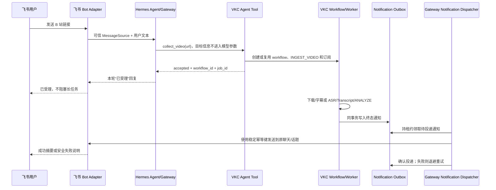

# 飞书 → Hermes → VKC → 飞书闭环实施计划

## 1. 目标与范围

目标是在飞书私聊或群聊中发送一个 B 站视频链接后，由 Hermes 自动调用 Video Knowledge
Collector（VKC）完成视频采集、字幕获取或 ASR、Transcript 建立和 Hermes 知识分析，并在长任务完成后，
把确定性的摘要与任务结果异步回复到原飞书会话。

目标交互：

1. 用户在飞书私聊中发送“采集并分析这个视频：`https://www.bilibili.com/video/BV...`”，或在群聊中
   `@Hermes` 后发送同样的指令。
2. Hermes 校验请求并立即回复“已受理”，包含任务编号、查询/取消提示，以及快速探测已经得到的视频标题
   （若有）。此回复不等待视频下载、ASR 或模型分析完成。
3. VKC Worker 按现有持久化流水线完成下载、字幕优先、ASR 回退、Transcript、索引和知识分析。
4. 成功后，系统在原聊天和原话题中回复摘要、章节、知识点、建议问答、降级提示和媒体/任务编号；失败后
   回复安全的错误分类和可操作建议。
5. Hermes 重启、飞书短暂不可用或消息发送超时不会丢失任务和终态通知；重复入站事件、重复链接及投递重试
   不会创建无界重复任务或明显重复回复。

第一版范围限定为普通 B 站点播视频。直播订阅、用户从飞书上传本地视频、自动生成飞书文档，以及跨平台
转发放在闭环稳定之后。

## 2. 当前基础与缺口

已经具备：

- 飞书适配器可以接收私聊、群聊、话题消息，并向指定聊天/话题回复文本和富文本。
- `POST /sources/ingest` 可以创建视频采集任务，`auto_analyze=true` 时采集 Worker 会继续创建
  `ANALYZE` 任务。
- VKC 已有持久化 Job 状态机、租约、重试、事件记录、Transcript 和知识文档。
- Hermes 已有 `search_videos`、`search_transcript`、`get_segments`、`search_knowledge` 和
  `get_knowledge_documents` 等只读 VKC 工具。
- Hermes 已有共享的平台投递能力和飞书发送实现。

尚缺：

- Hermes 没有 Agent 可调用的 VKC 采集工具。
- 工具执行层没有把可信的 `platform/chat_id/thread_id/message_id/user_id` 交给 VKC 工具；这些值不能
  由模型参数提供。
- 采集任务和自动创建的分析任务之间没有面向外部请求的稳定 workflow/correlation 标识。
- 没有持久化“原会话订阅”和通知 Outbox，也没有监听 VKC 终态并投递到飞书的 Gateway 服务。
- 没有适合飞书长度和 Markdown 能力的确定性结果渲染器。
- 当前 B 站真实环境仍可能受到 HTTP 412、频控、地区限制或 Cookies 失效影响。

## 3. 目标架构



关键设计决定：

- 长任务采用“立即确认 + 异步终态通知”，不让一次 Agent turn 持续轮询几分钟或几小时。
- Worker 不导入飞书、React 或具体消息适配器；它只通过应用服务产生持久化领域事件/Outbox 记录。
- 飞书目标来自 Gateway 收到的可信消息上下文，通过非模型可见的 `ToolInvocationContext` 注入工具 handler。
  `collect_video` 的 JSON Schema 不包含 `chat_id`、`thread_id` 或 `user_id`。
- 结果使用确定性模板读取已经通过 VKC 校验的 READY 文档，不再启动一次自由 Agent 对结果二次改写，避免
  Transcript/标题中的提示注入影响投递目标或执行行为。
- 投递语义为持久化、至少一次；飞书发送必须复用同一稳定 UUID/幂等键，使网络超时后的重试在平台侧也尽量
  去重。
- 同一个视频 workflow 可以有多个订阅者；重复的同一飞书消息只创建一个订阅和一次确认/终态投递。

## 4. 飞书平台配置步骤

以下步骤可以在代码开发前完成。推荐使用飞书长连接（WebSocket），因为 Windows 本机运行 Hermes 时无需
公网域名、TLS 证书或反向代理。

### 4.1 创建应用和机器人

1. 打开[飞书开放平台](https://open.feishu.cn/)，创建企业自建应用。
2. 在“凭证与基础信息”记录 App ID 和 App Secret。App Secret 只保存到 Hermes Secret/.env，禁止写入
   仓库、日志、截图或聊天消息。
3. 在“应用能力 → 机器人”中启用机器人，为机器人设置名称和头像。
4. 设置应用的可用范围；开发期只包含测试人员和测试群，验收通过后再扩大范围。

也可以运行 `hermes gateway setup`，选择 **Feishu / Lark**，使用扫码创建流程自动完成基础应用和凭据
配置；若扫码流程不可用，再按上面的手工步骤创建。

### 4.2 配置权限

在“权限管理”中申请并由管理员批准：

| 权限 | 是否必须 | 用途 |
|---|---:|---|
| `im:message` | 是 | 接收和读取用户消息 |
| `im:message:send_as_bot` | 是 | 发送受理和终态结果 |
| `im:resource` | 是 | 保持 Hermes 飞书媒体能力完整；后续可接收附件 |
| `im:chat` | 是 | 获取聊天/群信息 |
| `im:chat:readonly` | 是 | 读取聊天和成员信息 |
| `im:message.reactions:readonly` | 建议 | 支持 Hermes 的处理状态表情 |
| `admin:app.info:readonly` | 建议 | 自动识别机器人身份，保证群聊 @ 门控正确 |
| `contact:user.id:readonly` | 建议 | 稳定解析用户 ID 并执行 allowlist |

MVP 不依赖云文档、会议或通讯录写权限，不应为了本功能申请这些权限。

### 4.3 配置事件与连接方式

1. 在“事件与回调”选择“使用长连接接收事件”。
2. 订阅 `im.message.receive_v1`。
3. 如果后续实现取消/重试交互卡片，再订阅 `card.action.trigger`，并在“应用能力 → 机器人”中启用
   “交互式卡片”。MVP 只用文字命令时不需要卡片回调。
4. 发布一个应用版本并等待企业管理员审批。权限与事件通常要在版本发布后才生效。

如果必须使用 Webhook：

- 将事件地址配置为公开可访问的 `https://<host>/feishu/webhook`。
- 在 Hermes 中设置 `FEISHU_CONNECTION_MODE=webhook`、`FEISHU_ENCRYPT_KEY` 和
  `FEISHU_VERIFICATION_TOKEN`，并完成 URL 验证。
- 交互卡片的“消息卡片请求网址”也指向同一受保护地址。
- 不直接把本机 `8765` 端口暴露到公网，应放在限制请求体、TLS 和来源访问策略的反向代理之后。

### 4.4 配置 Hermes

推荐运行：

```powershell
hermes gateway setup
```

选择 **Feishu / Lark** 并填写凭据。手工配置时，在 Hermes profile 的 Secret/.env 中设置：

```dotenv
FEISHU_APP_ID=cli_xxx
FEISHU_APP_SECRET=<secret>
FEISHU_DOMAIN=feishu
FEISHU_CONNECTION_MODE=websocket
FEISHU_ALLOWED_USERS=ou_xxx,ou_yyy
FEISHU_GROUP_POLICY=allowlist
FEISHU_REQUIRE_MENTION=true
```

配置要求：

- 生产环境不要设置 `FEISHU_ALLOW_ALL_USERS=true`，也不要把群策略设为 `open`。
- 保持 `group_sessions_per_user: true`，避免共享群聊中不同用户互相继承会话历史。
- 运行 `hermes tools`，为 `feishu` 平台确认启用 `video_knowledge` toolset。手工配置等价于确保
  `platform_toolsets.feishu` 中包含 `video_knowledge`，并且它不在 `agent.disabled_toolsets` 中。
- 在目标群中添加机器人；群聊命令必须 `@机器人`，私聊不需要 @。
- 可在运维告警群执行 `/set-home` 或设置 `FEISHU_HOME_CHANNEL=oc_xxx`。正常任务结果仍回复原始会话，
  home channel 只作为无法恢复原目标时的运维告警目的地。
- Hermes 与 VKC 使用同一个 profile；否则 Agent 工具、VKC 数据库和 Worker 会落入不同隔离空间。

### 4.5 配置 B 站运行条件

1. 使用一个公开、短时长、无登录限制的视频作为首个 smoke test。
2. 确认 Hermes 的 yt-dlp、FFmpeg/ffprobe、faster-whisper 模型和分析模型均处于 READY 状态。
3. 若公开链接稳定出现 412/频控，使用合法账号导出的 Netscape `cookies.txt` 配置当前 profile 的
   `VKC_YT_DLP_COOKIES_FILE`，然后重启 Hermes。远程飞书命令不接受 Cookies 文件路径参数。
4. Cookies 仅保存在受控本机，限制文件 ACL；不得写入数据库 API 响应、任务事件、日志或 Git。
5. Cookies 不能解决已删除、私有且未授权、地区不可用或账号本身无权访问的视频。

## 5. 代码实施阶段

每个阶段独立提交并保持主干可运行。先完成通用 workflow 与投递抽象，再增加飞书特定的展示和验收，避免
把 VKC Worker 与飞书实现直接耦合。

### 阶段 0：契约、开关和基线验证

状态：2026-09-06 已完成，见 [阶段 0 契约与验收记录](feishu-vkc-stage0.md)。三个新工具的注册属于阶段 1；
阶段 0 仅同步现有五个只读工具。固定 B 站样本在当前环境返回 RATE_LIMITED，真实闭环 smoke 保留为后续验收。

工作项：

- 定义命令语义：`collect_video`、`get_collection_status`、`cancel_collection`。第一版只接受 B 站
  `bilibili.com` 子域和 `b23.tv` 短链。
- 增加默认关闭的功能开关，例如 `VKC_MESSAGING_INGEST_ENABLED=false`，以及允许平台、单用户并发数、
  单日提交量、最大视频时长和最大清晰度等运维配置。
- 记录现有 Desktop 采集和飞书普通问答基线，准备一个固定公开测试视频和一个模拟适配器用例。
- 修正 `plugins/video_knowledge/plugin.yaml` 的 `provides_tools` 与实际五个只读工具不一致的问题，随后再
  增加三个新工具，确保工具发现、配置 UI 和运行时注册一致。

验收：功能开关关闭时行为与当前版本完全一致；飞书普通消息和 Desktop VKC 回归测试通过。

### 阶段 1：可信工具调用上下文与采集工具

状态：2026-09-06 已完成，见 [阶段 1 可信上下文与采集工具验收记录](feishu-vkc-stage1.md)。阶段 1
使用最小持久化受理回执保证入站消息幂等；完整 workflow、订阅、父子任务关联和 Outbox 仍属于阶段 2–4。

工作项：

- 在 Hermes 工具调用链引入只读 `ToolInvocationContext`，至少包含 profile、session ID、platform、
  chat ID、thread ID、触发 message ID、发送者 ID 和授权结果。
- 上下文由 Gateway 的 `MessageSource` 生成，通过 ContextVar/handler kwargs 传递；不写入模型可见参数、
  prompt 或工具 Schema，并验证并发 turn/profile 之间不会串值。
- 在 `plugins/video_knowledge/tools.py` 注册：
  - `collect_video(url)`：创建/复用采集 workflow，强制 `auto_analyze=true`；
  - `get_collection_status(workflow_id)`：只返回该请求者有权查看的状态；
  - `cancel_collection(workflow_id)`：仅允许原请求者或配置的管理员取消。
- 工具直接调用 transport-neutral 应用服务/`ManagedVideoKnowledgeRuntime`，不通过 shell、curl 或另起
  VKC HTTP listener。
- 工具不接受 `cookies_file`、任意回调 URL、目标平台/聊天 ID、本地路径或模型任意系统提示。
- Agent 本轮只回复受理结果；工具不得同步等待下载和分析完成。

主要修改位置：

- `plugins/video_knowledge/tools.py`、`plugins/video_knowledge/__init__.py`、`plugin.yaml`
- Hermes 工具 dispatch/runtime helper 和可信 session context
- `backend/app/services` 中新增 workflow 编排服务

验收：同一飞书消息重放不会重复创建请求；不同会话并发调用不会串投递目标；模型伪造 `chat_id` 会在
Schema 层被拒绝或完全不可见。

### 阶段 2：持久化 workflow、订阅和任务关联

状态：2026-09-06 已完成，见 [阶段 2 workflow 与订阅验收记录](feishu-vkc-stage2.md)。本阶段已建立
Outbox 持久化契约并为 READY 缓存命中写入即时终态通知；通用终态 projector、租约领取和实际投递属于阶段 3–4。

工作项：

- 新增 Alembic migration 和模型：
  - `collection_workflows`：workflow ID、源/媒体、ingest job、analysis job、派生状态和时间；
  - `workflow_subscriptions`：workflow、可信 origin、请求者、投递策略和入站幂等键；
  - `notification_outbox`：通知类型、订阅、状态、尝试次数、下次尝试时间、租约及稳定幂等键。
- 为 Job 增加非敏感的 `workflow_id` 和 `parent_job_id`，不要把飞书目标塞进 `input_json` 或公开的
  `JobRead`。
- `INGEST_VIDEO` 创建 `ANALYZE` 时传播 workflow/parent 关联；只有分析成功才算默认 workflow 成功。
- 采集失败、分析失败、取消、重试和缓存命中均形成明确 workflow 终态。重试不得创建第二份订阅。
- 同 URL 去重规则：同一入站 message ID 幂等；不同用户提交同一个活动任务时复用 workflow 但各自保留
  订阅；已有 READY 结果时产生即时完成通知，不重新分析，除非未来显式支持 `force`。
- workflow 状态不能绕过 `JobStateMachine` 修改 Job；每个 Job 状态变化仍产生 `job_events`。

验收：在 ingest 完成、analysis 尚未完成的窗口不会提前通知成功；进程在任意阶段重启后关联仍可恢复。

### 阶段 3：事务性终态 Outbox 与恢复

工作项：

- 在 Job 终态事务中调用 workflow projector：成功或失败更新 workflow，并以唯一键写入 Outbox。
- 增加 Outbox `claim/heartbeat/ack/fail/release_due` 服务，沿用 Worker 租约思想，但使用独立通知租约，
  避免影响 Job lease。
- 失败采用有上限的指数退避；认证失效等稳定错误进入 `DEAD` 并产生安全运维事件，临时网络错误继续重试。
- 启动时运行 reconciliation：扫描终态 workflow 与缺失的唯一 Outbox 记录，补齐“Job 已完成但通知未写入”
  的历史窗口。
- 数据库存储目标 ID 但不存 App Secret、access token、Cookies、Authorization header 或签名 URL。

验收：模拟在终态提交、领取、远端发送、确认各点崩溃，通知不丢失；同一终态最多只有一个有效 Outbox
记录。

### 阶段 4：Gateway 异步投递与飞书结果渲染

工作项：

- 在 Hermes 托管的 VKC runtime 中启动每 profile 唯一的 `NotificationDispatcher`；它领取 Outbox，
  调用 Gateway 已有的平台投递层，不让 Worker import 飞书适配器。
- 保留原 `chat_id/thread_id/reply_to_message_id`。原消息被撤回时，沿用飞书适配器既有的安全回退策略；
  话题内回复失败时不要误发到群聊顶层。
- 扩展飞书发送路径，使一次 Outbox 投递及其网络重试复用稳定 UUID，而不是每次生成新 UUID。
- 实现确定性消息模板：
  - 成功：标题、作者、时长、简短摘要、有限数量章节/知识点/建议问答、分析版本、workflow/media ID；
  - 降级：明确列出存在 Transcript fallback 的时间范围，不把兜底结果伪装成完整模型分析；
  - 失败：安全错误码、当前阶段、是否可重试和操作建议，不包含命令 stderr、路径或凭据；
  - 超长结果：按飞书能力分块，首条是结论，其余为同一话题的详情；每块使用可追踪的 part 编号和幂等键。
- 不把 Transcript 或知识文本重新作为指令交给 Agent；渲染层按字符/条目上限截断并转义不安全结构。
- 无法向原目标投递时，仅向配置的 home channel 发送不含视频私密内容的运维告警。

验收：Gateway 重启后自动继续投递；飞书 API 超时重试不产生明显重复消息；私聊、群聊和话题回复位置正确。

### 阶段 5：状态查询、取消/重试与交互体验

工作项：

- 支持自然语言查询“刚才的视频处理到哪里了”，由 `get_collection_status` 返回权威阶段和进度。
- 支持“取消刚才的视频任务”，由工具解析成 workflow ID 后执行权限校验并调用现有状态机取消。
- 失败通知提供文字重试指令；第二迭代可增加飞书交互卡片“查看状态/取消/重试”。
- 卡片 action 只能引用短期、签名或服务端保存的 action token，不能信任客户端回传的 workflow/user/target。
- 受理消息只承诺“任务已排队”，不承诺完成时间；可选择对长任务发送一次低频里程碑通知，禁止逐条转发
  `job.progress` 造成刷屏。

验收：未授权用户无法查询、取消或重试他人的 workflow；重复点击卡片在现有 15 分钟去重窗口和服务端
幂等约束下只执行一次。

### 阶段 6：安全、配额和 B 站可靠性加固

工作项：

- 对 URL 做 scheme、域名、DNS/IP 和重定向后目标校验，拒绝 localhost、私网、链路本地和非 HTTP(S)
  地址，防止把消息入口变成 SSRF/任意下载入口。
- 初始 allowlist 只允许 B 站正式域名与短链；扩展其他平台必须显式配置并补测试。
- 按 profile/user/chat 设置提交频率、活动 workflow 数量、视频时长、下载清晰度和存储余量限制。
- 只有已通过飞书 Gateway ACL 的真人消息可以提交；默认继续忽略其他机器人消息。
- 飞书用户、聊天和消息 ID 按个人数据管理，只为鉴权、路由和审计保留必要期限；提供定期清理策略，但不得
  在仍有活动 workflow 或待投递 Outbox 时提前删除关联。
- 将标题、描述、字幕和知识内容始终标记为不可信数据；错误、审计日志和指标统一脱敏。
- 为 412、登录要求、限流、视频不存在、字幕失败、ASR 失败、模型失败建立稳定错误映射与用户文案。
- 增加 Cookies 过期检测提示，但永不把 Cookies 内容或路径发回飞书。

验收：SSRF、跨用户访问、伪造目标、prompt injection、日志泄密和配额绕过测试全部通过。

### 阶段 7：端到端验收、文档与发布

自动化测试矩阵：

| 层级 | 必测内容 |
|---|---|
| 单元 | URL/短链策略、上下文隔离、workflow 派生、权限、渲染截断、错误脱敏 |
| 数据库 | migration、唯一键、父子任务传播、Outbox lease/重试/reconciliation |
| VKC 集成 | ingest → Transcript → ANALYZE 成功/失败/取消/重试/缓存命中 |
| Gateway 集成 | 飞书 origin 捕获、工具注册、平台 ACL、原会话路由、稳定发送 UUID |
| 故障注入 | Worker/Gateway 重启、SQLite busy、飞书 429/5xx/超时、撤回原消息 |
| 真实 smoke | 飞书私聊、群聊 @、群话题各完成一个公开 B 站短视频闭环 |

发布步骤：

1. 备份测试 profile，执行 migration，并运行 `scripts/check.ps1`。
2. 在测试飞书应用和测试群部署，保持 `VKC_MESSAGING_INGEST_ENABLED=false`。
3. 启动 Hermes，检查 Feishu adapter、VKC Worker、分析模型和 NotificationDispatcher 健康状态。
4. 只对白名单测试用户打开功能，执行真实 smoke 和一次断网/重启恢复测试。
5. 观察 Outbox backlog、投递成功率、重试数、workflow 总耗时、各阶段失败率和磁盘占用。
6. 达到验收门槛后扩大飞书应用可用范围；仍保持 allowlist 和资源配额。
7. 更新 `docs/project-memory.md`、API 文档、用户手册、故障排查和 Windows RC 验收清单。

回滚顺序：先关闭 `VKC_MESSAGING_INGEST_ENABLED`，停止接受新飞书采集；继续排空已创建任务和 Outbox；
若投递器有问题则停止 dispatcher、保留待投递记录，再回滚应用代码。回滚不得删除媒体、Transcript、知识
文档、workflow 或通知记录。

## 6. 建议提交/PR 切分

1. **Contract and context**：功能开关、plugin manifest 同步、可信 `ToolInvocationContext` 和相关测试。
2. **Collection workflow**：采集/状态/取消工具、workflow/订阅 migration、父子 Job 关联和去重。
3. **Transactional outbox**：终态 projector、Outbox lease、reconciliation 和故障注入测试。
4. **Gateway delivery**：通用 dispatcher、飞书稳定 UUID、原聊天/话题路由和确定性渲染。
5. **Controls and hardening**：状态/取消/重试 UX、URL/SSRF 策略、配额、错误映射和卡片（可选）。
6. **Release acceptance**：真实飞书+B站 smoke、运维指标、用户文档和 RC 检查表。

每个 PR 都必须保持 API schema、客户端类型、migration、插件 manifest 和文档同步；不得把未完成的写入工具
默认暴露给所有消息平台。

## 7. MVP 完成定义

满足以下条件才算闭环完成：

- 白名单用户可从飞书私聊和群聊 @ 提交允许的 B 站链接，并在 5 秒内收到持久化任务的受理回复。
- VKC 自动完成采集、Transcript 和 Hermes 分析，无需打开 Desktop 页面进行人工操作。
- 成功或失败终态会在原飞书聊天/话题送达，Hermes/Gateway/Worker 任一进程重启后仍能恢复。
- 同一入站事件、同一 Outbox 重试和飞书网络超时不会导致重复采集或明显重复结果。
- 用户可以查询状态和取消自己的活动任务，不能操作其他用户的任务。
- 返回内容包含降级标志和可追踪的 workflow/job/media ID，且不泄露 Cookies、密钥、路径、header 或原始
  工具错误输出。
- B 站 412、登录要求、限流、不可用视频、ASR/模型失败都有稳定、安全且可操作的飞书提示。
- 相关 Python、Gateway、Desktop、插件工具、migration、故障恢复与真实飞书 smoke tests 全部通过。

## 8. 后续增强（不阻塞 MVP）

- 将完整分析导出为飞书云文档，并在消息中只返回摘要和文档链接。
- 支持用户在飞书直接上传视频文件，由受控附件导入替代任意本地路径。
- 支持 B 站合集/播放列表、直播订阅和按系列聚合分析。
- 支持选择分析模型、语言、ASR 模型和输出模板，但所有参数都使用服务端 allowlist。
- 提供 Desktop 中的 workflow/通知投递状态页和“重新投递”管理操作。
- 在其他 Hermes 消息平台复用同一个可信 context、workflow 和 Outbox，仅替换目标平台渲染能力。
