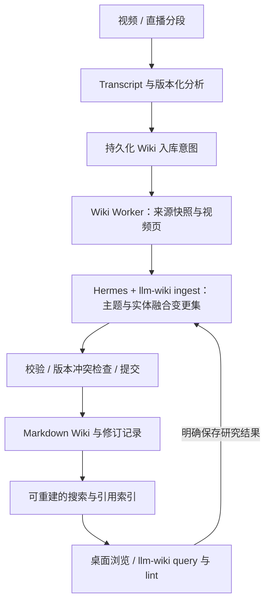

# 视频知识库（LLM Wiki）分阶段实施与验收计划

版本：1.1 · 制定/更新日期：2026-09-24 · 状态：阶段 0 已通过；Wiki 运行时尚未实施。

本次修订：将运行时实际加载 Hermes `llm-wiki` Skill 列为必选要求，补充 ingest/query/lint 集成契约与验收证据。

## 1. 目标与设计依据

在现有 Hermes 视频知识插件中增加个人知识库：每个视频分析完成后形成可追溯的视频知识页，并逐步更新跨视频的主题、实体和对比页面；用户可以浏览、搜索、提问，将有价值的研究结果再次沉淀。

参考 Karpathy 的 [LLM Wiki 原文](https://gist.github.com/karpathy/442a6bf555914893e9891c11519de94f)（核对日期：2026-09-24）：采用不可变来源、持续维护的 Wiki、约束维护行为的规范三层；支持 ingest、query、lint 三类操作，保留索引和追加日志。该原文是思想说明而非软件接口规范。

Hermes 的 [llm-wiki Skill](https://github.com/NousResearch/hermes-agent/blob/main/skills/research/llm-wiki/SKILL.md) 是本功能必须实际使用的知识维护技能。ingest 融合、query 问答、lint 语义巡检均须在 Hermes 执行上下文中加载该技能。实施时以工程锁定的 Hermes 子模块版本为准，固定所采用的 Skill/Prompt 版本；本计划中的任务、事务、UI、引用契约均为 VKC 的工程设计，不假定上游已有这些接口。

### 1.1 现有基础与集成位置

- 项目已经集成进 Hermes Desktop；主工程为 `D:\workspace\video-knowledge-collector`。
- 活跃后端：`thirdparty/hermes-agent/plugins/video_knowledge/backend/`。
- 活跃前端：`thirdparty/hermes-agent/apps/desktop/src/plugins/video-knowledge/`。
- `app/services/knowledge_service.py` 已产出四类版本化 `KnowledgeDocument`。
- `app/schemas/knowledge.py` 已定义 `AnalysisBundle`、`CitationRef` 和分析降级标记。
- `worker/analysis_pipeline.py` 已管理分析任务完成；任务持久化、租约、取消与事件继续使用现有状态机。
- 已有飞书通知 outbox，但它面向通知投递；Wiki 发布不得直接混入其通知状态和接收者逻辑。

### 1.2 本轮范围

交付一个 Hermes profile 内的个人视频 Wiki，支持自动入库、历史补录、跨视频融合、阅读检索、引用回看、知识库问答和维护巡检。继续使用 Hermes 的启动入口和托管后台，不要求用户启动额外 Wiki 服务。

首版不包含多人协同、公共网站发布、外部网站自动爬取、强制向量数据库、画面多模态分析。知识图谱可视化、PDF/幻灯片导出列入后续增强，不作为本轮验收依赖。

## 2. 总体架构



### 2.1 数据职责

| 数据 | 权威来源 | 处理规则 |
| --- | --- | --- |
| 原媒体、任务、Transcript、分析版本 | 现有 VKC 存储与数据库 | Wiki 不改变原始任务结果 |
| 入库来源包 | Wiki 的 `raw/` | 每版本不可变；重新转写或分析产生新快照 |
| 已发布知识正文 | 已提交的 Markdown 文件 | 支持编辑检测、历史修订与冲突处理 |
| Wiki 规范 | `SCHEMA.md` | 版本化，变更后显式触发必要的重编译 |
| 入库任务、租约、提交协调 | 数据库 | 不能仅靠目录存在推断任务成功 |
| 搜索、反向链接、统计 | 数据库投影 | 可从已提交文件、manifest 重建 |

默认在配置的 `storage_root/wiki/` 下创建独立目录，保存稳定 `wiki_id`；允许配置 storage root 内的其他 Wiki 子目录。首版不直接写入任意外部 Obsidian 仓库，不修改用户全局 `WIKI_PATH`。以后需要外部目录时另行设计明确授权与迁移。Hermes 通过当前插件提供的 Wiki 工具访问同一知识库。

### 2.2 建议目录

```text
wiki/
├── SCHEMA.md                  # 领域、页面类型、标签、引用、合并规则
├── index.md                   # 分类目录，大规模时分拆为主题目录
├── log.md                     # 按 commit_id 追加，可轮转
├── raw/videos/{media_id}/{source_revision}/
│   ├── metadata.json          # 来源 URL、作者、日期、标识及内容哈希
│   ├── transcript.json        # 保留 segment ID 和毫秒时间范围
│   ├── transcript.md          # 便于阅读的带时间戳文本
│   ├── analysis.json          # 模型生成的四类分析及降级信息
│   └── manifest.json          # 来源版本、校验和与文件清单
├── videos/                    # 每视频稳定页面；历史在修订中保留
├── sessions/                  # 已知直播场次的分段目录
├── concepts/                  # 跨视频概念、主题、方法
├── entities/                  # 人物、机构、产品、工具等
├── comparisons/               # 多来源对比
├── queries/                   # 用户明确保存的研究答案
├── notes/                     # 用户笔记，自动编译器不覆盖
└── _meta/
    ├── commits/               # 已提交变更 manifest 与必要历史内容
    ├── staging/               # 未提交变更，用户不可见
    └── reports/               # 巡检与验收报告
```

Markdown 使用标准相对链接；若锁定的 Hermes Skill 默认使用 `[[wikilinks]]`，通过 VKC 规范适配。首版不要混用两种链接语法。Obsidian 可阅读这些 Markdown 文件，但不宣称具备完整 Obsidian 插件兼容性。

### 2.3 页面与引用契约

页面 frontmatter 至少包含 `page_id`、`type`、`title`、`aliases`、`tags`、`created_at`、`updated_at`、`revision`、`schema_version`、`source_refs`、`generation_metadata`。路径由应用生成，使用稳定 ID 或受控 slug；标题可变化而 page_id 不变。

结论级引用至少包含：`source_revision`、`media_id`、`transcript_id`、`segment_ids`、`start_ms`、`end_ms`。来源包另记录具体 `knowledge_document_ids`、模型与 Prompt 版本、内容哈希。

- 引用必须落在对应 Transcript 的真实片段和时间范围中。
- 摘要未提供的引用不能由模型任意补造；应追溯分析条目或原始片段，否则标为“来源概述”而非已验证结论。
- Markdown 可链接到来源快照中的片段锚点；桌面引用组件根据结构化引用打开现有播放器并跳转。阶段 1 定义明确的跳转契约，不假定现有路由已支持时间参数。
- 直播分段保存分段内时间；只有存在可靠场次和偏移数据时才显示整场时间，不按文件数量估算。
- 原视频被删除时仍可阅读知识与文本证据，播放器明确提示媒体不可用。

### 2.4 写入与恢复规则

1. 分析版本落库与 Wiki 入库意图必须在同一数据库事务中提交，或采用具有等价保证的事务 outbox；仅在 Worker 完成后临时调用函数不满足要求。
2. 入库键由 `wiki_id + media_id + transcript_id + 完整分析版本集合哈希 + schema/compiler版本` 构成；变化产生新修订，重复投递复用原结果。
3. 固定本次输入版本。任务排队后出现新版分析，不得混读新旧四类文档；旧版本晚完成也不能覆盖已发布的新版本。
4. LLM 生成受限变更集。应用校验文件路径、页面类型、引用和 base revision 后提交；禁止模型直接对整个文件系统自由写入。
5. 首版同一 Wiki 串行提交；模型生成可在锁外执行，但提交前必须检查 revision。锁需要租约及 fencing token，过期 Worker 不得继续提交。
6. 多文件发布不能仅靠逐个 `os.replace` 声称整体原子。实现提交日志、备份/新内容、提交标记与恢复流程；应用读取仅展示已提交修订。进程崩溃后恢复或回滚到一致版本，再开放读写。外部编辑器在提交期间可能短暂看到中间文件状态，此限制需在用户文档中说明。
7. 文件发布成功但数据库确认失败时，重试依据 commit_id 完成确认，不再次调用模型或重复追加日志。
8. Wiki 失败只影响 Wiki 入库状态，视频采集和分析成功状态保持不变。
9. `degraded` 分析可保存来源包与带警示的视频页，但不自动将降级内容提升为确定的主题事实。模型自报 confidence 不等同事实可靠性。
10. 外部手动修改导致哈希变化时标记冲突；自动更新不得静默覆盖。用户笔记与生成正文分开管理。

### 2.5 Hermes llm-wiki 技能使用契约（必选）

**技能来源与加载。** 使用 `thirdparty/hermes-agent/skills/research/llm-wiki/SKILL.md`，本次核对其声明版本为 `2.1.0`；阶段 0 固定实际内容 SHA-256、子模块提交和适配层版本，不能仅凭版本字符串判断一致。每次新的 Wiki Agent 执行上下文通过锁定版本的 Hermes 原生技能加载机制加载技能及本次操作需要的资源，确保完整指令实际进入模型上下文。不能仅在 Prompt 中写“请使用 llm-wiki”、复制几句说明，或用普通结构化 LLM 请求替代技能执行。阶段 0 必须核实真实加载入口，不能假设存在某个 SDK 方法或 HTTP 参数。

**执行前定位。** 每次 ingest/query/lint 在开始知识处理前读取当前 Wiki 的 `SCHEMA.md`、`index.md` 和近期 `log.md`，再检索相关页面和来源；记录读取的版本。Wiki 根目录通过执行上下文和受控工具绑定；需要 `WIKI_PATH` 时使用执行实例隔离的配置，不在共享进程中来回改全局环境变量，也不回落到用户的其他 Wiki。

**职责分配。** Skill 指导来源理解、知识融合、关联、矛盾处理、问答与语义巡检；VKC 负责排队、证据快照、受限工具、校验、版本冲突、事务提交、索引与播放器跳转。技能要求的页面写入、索引更新和日志追加通过受控变更集/提交工具执行，权限由应用实际限制，不能只靠 Prompt 禁止越界。

**视频领域适配。** 保留上游 Skill 原文件，增加版本化 VKC 执行策略与 Wiki `SCHEMA.md`。阶段 0 形成差异清单，明确标准 Markdown 链接、视频来源目录、时间引用、用户笔记保护、原始快照不可变、争议不按新旧日期自动裁定，以及 query 仅在用户明确保存时写回等规则。上下文中明确这些业务约束对通用技能默认约定的覆盖关系，并用测试验证。

**执行与审计。** 保存脱敏的 `run_id`、操作类型、`wiki_id/profile`、技能标识/版本/hash、Hermes 提交、适配层版本、模型、规范/索引/日志读取版本、受控工具调用顺序、输入来源版本、输出 commit/report ID。由实际加载/工具执行事件生成证据，不能由模型自报“已使用技能”代替。默认不保存完整私人 Prompt 或思考内容。

**失败和升级。** 技能缺失、未启用、内容与固定 hash 不符或加载失败时，相关 Agent 操作明确失败或待处理，不能静默改用自定义 Prompt 并标记成功。已保存来源和视频页仍可读，融合状态单独展示。技能升级须更新适配清单并回归 ingest/query/lint；新技能 hash 纳入编译指纹，旧页面不自动被批量重写。

| 操作 | Skill 实际参与 | VKC 工程保障 | 落地阶段 |
| --- | --- | --- | --- |
| 来源导出、单视频模板页 | 不要求额外 Agent 调用 | 输入版本、引用与快照校验 | 1—4 |
| ingest | 加载技能、阅读规范与目录、理解来源、融合关联与争议 | 变更集校验、修订提交、幂等重试 | 5 |
| query | 加载技能、检索阅读、证据回答、提出可保存结果 | 只读默认权限、引用回看、显式保存 | 6 |
| lint | 加载技能、阅读页面、检查语义矛盾/过时结论/知识缺口 | 确定性结构检查、报告、受控修复 | 7 |

阶段 1—4 的确定性导出只算基础入库，不得宣称已完成 Skill 驱动的知识融合；阶段 5 上线后，对新来源自动执行 ingest，并为已有基础视频页提供可重试的融合补录。

## 3. 分阶段执行方式

每阶段开始时读取当前 `AGENTS.md`、`docs/project-memory.md`、本计划和上一阶段报告，并检查相关目录的附加指令。下列模块名与接口名是建议，阶段 0 固定后记录调整。

实现 → 运行相关测试 → 人工验证 → 写验收报告 → 更新状态表。未通过的必验项不得以“测试环境不可用”标为完成，应记录阻塞与复现步骤。

开发可以使用固定模型响应验证流程，但真实融合效果必须在阶段 5 和最终验收中使用已配置 Hermes 模型验证。只跑 mock 不代表知识质量验收完成。

每阶段报告保存到 `docs/wiki-stage-{编号}.md`，证据与脱敏测试产物保存到 `artifacts/wiki-acceptance/stage-{编号}/`。不得将私人 Transcript、密钥或模型凭据自动加入 Git。

| 阶段 | 内容 | 前置 | 当前状态 |
| --- | --- | --- | --- |
| 0 | 契约与验收样本 | 无 | 已通过（见 `docs/wiki-stage-0.md`） |
| 1 | Wiki 初始化与存储 | 0 | 未开始 |
| 2 | 单视频来源与知识页 | 1 | 未开始 |
| 3 | 自动入库、补录与恢复 | 2 | 未开始 |
| 4 | 桌面知识库浏览与检索 | 3 | 未开始 |
| 5 | 跨视频主题与实体融合 | 4 | 未开始 |
| 6 | Hermes Wiki 问答与研究沉淀 | 5 | 未开始 |
| 7 | 巡检、编辑冲突与知识更新 | 6 | 未开始 |
| 8 | 历史迁移、故障演练与整体交付 | 7 | 未开始 |

阶段 0—4 构成可交付的基础版；阶段 5—8 才达到本计划完整的持续知识库目标。

## 4. 阶段 0：冻结契约与验收样本

**交付物**：Wiki 架构 ADR、页面/schema 示例、入库状态与发布协议、测试样本目录及机器可读预期清单。

实施内容：

- 核实当前分析版本如何成组、分析完成事务位置、Hermes 客户端是否具备所需结构化生成能力。
- 核实 Hermes 原生技能加载及受控工具执行入口，固定 llm-wiki 内容 hash 与版本；设计 Wiki Agent 适配接口（置于现有 Hermes 集成边界内），区别于只生成 AnalysisBundle 的普通分析调用。
- 完整读取锁定版本的 Skill 及必要引用资源，输出与 VKC 规则的适配差异清单和审计字段契约；验证技能可被发现、启用与加载。
- 确认桌面插件 API、播放器跳转方式、工具注册入口及现有 Worker 多进程运行模式。
- 定义 `WikiSourceRevision`、`WikiIngestion`、`WikiPageProjection`、`WikiCommit` 的数据职责和迁移策略；不能把投影表当正文唯一来源。
- 准备 A/B/C 三个主题相关、至少一项观点冲突的固定样本，D 为无关主题，E 为降级分析，F 为同视频新版分析，L1/L2 为同一直播场次的分段。每个样本都有 Transcript、四类分析、合法引用和预期结果。
- 记录真实模型质量验证所选的用户已有媒体 ID；默认复用本地资料。

**验收**：

- [x] A—F、L1/L2 的来源、引用和预期关系可机器校验，冲突结论可由人工核对。
- [x] 规范明确自动写入范围、领域、标签、建页阈值、证据与观点区分、用户编辑处理方式。
- [x] 断点清单覆盖分析提交、入库排队、文件发布、索引确认四个边界。
- [x] ADR 明确本地根目录、版本策略、工具权限与接口；不依赖未知上游 API。
- [x] 提供实际技能加载入口的源码位置和最小加载验证记录，包含完整内容 hash；适配差异清单覆盖第 2.5 节，后续无需靠猜测选择 Agent 调用方式。

## 5. 阶段 1：Wiki 初始化与可靠存储

**建议位置**：后端 `app/services/wiki_storage_service.py`、`app/schemas/wiki.py`、迁移目录与 `tests/video_knowledge/wiki/`。

实施内容：初始化目录、SCHEMA/index/log；读取/列举页面；frontmatter 和链接解析；路径边界检查；提交 manifest、revision 和 hash 校验；串行提交锁及崩溃恢复骨架。

**验收**：

- [ ] 空目录初始化成功；再次初始化不覆盖用户文件，未知非空目录不会被直接重置。
- [ ] 中文标题、Windows 路径、超长标题和同名标题可处理；`../`、绝对路径、符号链接/junction 越界均被拒绝。
- [ ] 提交一组页面后 revision、hash、index、log 对应同一 commit_id。
- [ ] 在发布中途注入故障，重启后应用只能读取完整旧版或完整新版，无半成品。
- [ ] 模拟旧 Worker 租约过期，旧 fencing token 写入被拒绝。

## 6. 阶段 2：单视频来源快照与视频知识页

**交付物**：确定性的来源导出器、视频页模板、引用解析器；本阶段不增加跨视频 LLM 调用。

实施内容：固定输入版本、生成不可变 raw 来源包；按现有四类分析渲染视频页；保存分析生成属性和降级标记；建立视频页到来源片段的关联；有可靠场次信息时生成直播目录。

**验收**：

- [ ] 样本 A 生成来源快照与视频页，摘要、章节、知识点、问答完整可读。
- [ ] 每条结构化引用验证通过，引用数量及时间范围与原分析一致。
- [ ] 重复入库 A 不新增重复页面、来源包或提交日志。
- [ ] 入库 F 后视频页稳定 ID 不变、修订增加、A 的历史来源仍可访问。
- [ ] E 的降级段落明显标识；不伪装为验证后的知识。
- [ ] L1/L2 各自有页，场次目录关联正确，引用跳转到对应分段。

## 7. 阶段 3：自动入库、历史补录与独立恢复

**建议位置**：`knowledge_service.py`、`worker/wiki_pipeline.py`、Worker 路由、任务枚举及 Wiki 入库服务。使用独立任务类型，例如 `WIKI_INGEST`。

实施内容：事务性入库意图、去重调度、任务租约和重试；设置自动入库开关（升级默认关闭，用户启用后对新分析生效）；历史批量补录 dry-run 和确认提交；查询待入库、处理中、已完成、失败、冲突、需要复核等状态。

**验收**：

- [ ] 自动入库开启时，一次分析完成恰好产生一次逻辑入库；桌面与飞书来源一致。
- [ ] 在分析事务提交后、排队消费前杀进程，重启仍能生成入库任务。
- [ ] 关闭自动入库后不新建自动任务；手动入库可用，已排队任务的处理策略在设置中说明。
- [ ] 重复事件、重复点击、多个消费者不重复发布；新版先完成、旧版后完成不会回退页面。
- [ ] 入库失败不改变分析成功状态；单独重试只处理 Wiki，不重做下载、转写和分析。
- [ ] 补录预览能区分新增、已同步、版本更新、无分析、降级待复核；取消后已完成项保持有效。
- [ ] 文件提交后数据库确认失败可恢复；一次逻辑提交只留一条可见日志。

## 8. 阶段 4：桌面阅读、搜索与时间回看

**交付物**：Hermes Desktop 视频知识插件下的“知识库”页面；Wiki 读取/搜索/入库状态 API；可重建 FTS 索引。

实施内容：目录导航、类型/标签筛选、Markdown 阅读、来源列表、反向链接；媒体详情页入库状态与跳转；引用回看；手动同步/重试和历史补录入口。

**验收**：

- [ ] 一个 Hermes 启动入口即可访问知识库；没有额外要求启动的服务。
- [ ] A/D 中文关键词能命中正确页面；目录、标题和正文显示正常。
- [ ] 点 A 中任一时间引用打开正确媒体，播放器跳转误差目标不超过 1 秒，受媒体可寻址性限制的情况记录证据。
- [ ] 无结果、未初始化、长正文、缺失媒体、失效引用、任务失败都有明确界面。
- [ ] 清除测试环境的搜索投影后可重建，结果数量与内容不丢失；重建不改写正文。
- [ ] Markdown 中脚本、危险 URL、任意本地文件引用不能执行或绕过媒体访问边界。

## 9. 阶段 5：主题、实体与跨视频融合

**交付物**：`WikiCompiler`、受限变更集契约、实际加载 llm-wiki 的 Hermes Wiki Agent 适配器、主题/实体/对比页面。

实施内容：根据实体别名和搜索召回候选页面；读取相关页面与证据；生成新增/更新/关联/争议变更；校验后提交。建页阈值为某概念是单一来源的核心内容或被多个独立来源实质讨论，避免为一闪而过的词创建页面。同场直播切段不能自动算作多份独立佐证。

本阶段须按第 2.5 节加载技能执行 ingest，通过受控工具阅读来源、提交页面变更并更新 index/log。将基础入库后的融合接入自动任务链，支持对阶段 1—4 的视频页补做融合；分别展示“来源已入库”和“知识融合完成”。

每次只提供相关页面和必要来源片段，限制上下文、变更页数、调用次数与费用；超预算时保留来源和视频页，把融合状态标记为待处理。知识融合优先级低于现有录制与采集任务。

**验收**：

- [ ] A/B 共用同一主题/实体页面，别名不产生重复页；D 不因无关同词被错误合并。
- [ ] C 的冲突观点与 A/B 的观点并列展示，均有时间、来源和争议标记；不因日期较新就判其正确。
- [ ] 每项综合结论有可解析证据；推断、作者观点和材料中的事实明确区分。
- [ ] E 的降级结果不自动成为高可信主题断言。
- [ ] 两个任务更新同一页面产生 revision 冲突时重新合并或待复核，不能丢失任一方证据。
- [ ] 相同输入复跑不因模型措辞变化反复生成修订；编译器版本升级可显式重编译。
- [ ] 注入式 Transcript、非法变更路径、模型虚构片段 ID 被拒绝且原页面保持完整。
- [ ] 真实 Hermes 模型完成 A/B/C 融合，逐条人工复核全部引用与预期冲突，记录模型、耗时、调用量和结果差异。
- [ ] 真实 ingest 记录证明技能已加载并进入执行上下文，SCHEMA/index/近期 log 在知识处理前被读取，页面变更通过受控工具提交。
- [ ] 模拟技能缺失/禁用/hash 不匹配/加载失败，融合明确失败或待处理，不能用普通 Prompt 静默替代；原来源包与视频页保持可用。
- [ ] 新来源自动融合及旧基础视频页融合补录均调用同一技能入口，重复任务不重复发布。

## 10. 阶段 6：Hermes 问答与研究结果沉淀

**交付物**：Wiki 只读工具、问答界面和“保存到知识库”操作。建议工具包括 `wiki_search`、`wiki_get_page`、`wiki_get_evidence`；写入使用专用提交接口。

实施内容：问题先定位主题页，按需读取原始证据；答案携带页面修订和视频片段引用；用户明确保存时生成 query/comparison 页面，再走受限变更集。普通聊天默认不写入 Wiki。

Wiki 问答入口须实际加载 llm-wiki 并执行 query 流程；即使从聊天入口进入，也必须绑定当前 Wiki 和应用权限。保存研究结果沿用同一技能上下文或新建已加载技能的写入执行，并记录其原始 query run_id。

**验收**：

- [ ] 对 10 个预设问题测试：单视频事实 3 个、跨视频综合 3 个、冲突 2 个、证据不足 2 个。
- [ ] 8 个可回答问题均满足预设关键点，引用存在且支持对应结论；2 个证据不足问题明确说明不足，不捏造。
- [ ] 跨视频回答覆盖相关来源；冲突问题呈现分歧而非强行给出统一答案。
- [ ] 未点击保存不新增 Wiki 页；同一答案重复保存不重复建页。
- [ ] 保存的研究答案保留底层视频证据，不能把模型自己的旧答案当作新增独立佐证。
- [ ] 已保存 query 页面能被后续搜索和问答找到，引用可回看；检索范围限制在当前 Wiki/profile。
- [ ] 至少一次真实 query 的加载、规范读取、检索与证据调用记录完整；有无“保存”操作的权限和产物符合预期，不能以单次裸模型请求替代该流程。

## 11. 阶段 7：Lint、修订与知识生命周期

**交付物**：确定性结构巡检、由 llm-wiki lint 驱动的语义巡检、修订对比、来源撤回和用户编辑冲突处理。语义巡检功能必须实现并验收，是否定时运行由配置决定。

实施内容：检查断链、孤立页、缺失来源、过期版本、标签错误、未处理争议与重复实体候选。语义巡检给出带证据的建议；不自动删除或“纠正”有争议结论。来源重新分析或撤回时，根据反向引用标记受影响页面并重编译。

结构检查由确定性代码完成；语义巡检实际加载 llm-wiki 执行 lint，读取规范、索引、近期日志与相关页面，产出结构化问题和证据。lint 默认仅生成报告；选择执行修复时走同一版本校验与提交服务。

**验收**：

- [ ] 注入预设结构错误，结构巡检全部发现；语义问题按预设样本人工复核，不承诺开放语料中 100% 检出。
- [ ] 修复索引和断链建议后重复巡检结果稳定，原始快照不变。
- [ ] 编辑生成页面后，后续同步检测到外部修改并给出差异；`notes/` 内容不被覆盖。
- [ ] 回退页面生成新的修订且保留审计，当前索引、反向链接同步更新。
- [ ] 撤回 B 后相关页面不再把 B 作为有效支撑；历史快照保留并标明撤回，不删除视频。
- [ ] 删除媒体与删除知识为不同操作；修改 Wiki 规范可预览受影响内容并选择重编译。
- [ ] 真实 lint 的技能加载与页面读取证据可追踪，发现样本中的预设语义冲突；仅运行结构检查不能标记语义巡检验收通过。

## 12. 阶段 8：历史迁移、故障演练与整体交付

**交付物**：历史入库工具、运维/用户文档、备份恢复说明和最终验收报告。

实施内容：先 dry-run 扫描现有分析；按选择范围补录，限速并保留每项结果；完成端到端演示与故障注入。备份需同时考虑 Wiki、业务数据库与媒体定位信息，暂停提交或用一致性快照，不能复制一半更新中的目录充当可靠备份。

**验收**：

- [ ] 完成一次本地媒体→分析→自动 Wiki 入库→主题更新→提问→点击时间回看的真实闭环。
- [ ] 至少 10 个历史视频和一组直播分段完成补录；缺少真实资料时由固定样本补足并明确标注，两者分别报告。
- [ ] 不下载、不重新转写、不重做已有分析；重复补录不新增重复页。
- [ ] 注入模型超时、磁盘空间不足、进程退出、提交冲突、索引写入失败均可诊断与恢复，已提交内容不丢失。
- [ ] 并发两项融合不丢更新；旧租约写入被拒绝；数据库与文件一致性检查通过。
- [ ] 在记录配置的测试机器上，1,000 个页面的本地搜索暖缓存 p95 目标 < 1 秒，读取页面 p95 < 500 ms（不含模型和播放器）；记录至少 30 次请求的方法与结果，未达标说明瓶颈。
- [ ] 从备份恢复到新测试目录，可阅读页面、重建索引并追溯来源；原媒体未随备份迁移时明确提示。
- [ ] 现有采集、直播、转写、分析、飞书通知及桌面入口回归通过。
- [ ] 使用文档说明自动入库、补录、同步失败、争议、人工编辑、撤回来源、备份及模型费用。
- [ ] 使用固定版本 llm-wiki 完成真实 ingest/query/lint 三条链路，审计可关联到页面修订、答案和巡检报告；演练技能加载失败及受控升级，不静默绕过技能。

## 13. 验证命令与证据要求

阶段实施时以仓库当时的 `AGENTS.md` 和脚本为准。当前基线命令：

```powershell
Set-Location -LiteralPath 'D:\workspace\video-knowledge-collector'
uv run --project thirdparty/hermes-agent --extra dev pytest thirdparty/hermes-agent/tests/video_knowledge
npm.cmd --prefix thirdparty/hermes-agent/apps/desktop run typecheck
.\scripts\check.ps1
```

新增 Wiki 测试推荐放在 `thirdparty/hermes-agent/tests/video_knowledge/wiki/`。每阶段运行相应测试和受影响模块检查；阶段 4、5、8 完成时运行完整回归。前端阶段附真实桌面操作证据，不能仅用编译成功代替交互验收。

每份阶段报告使用以下结构：

```markdown
# Wiki 阶段 N 验收报告
- 状态：未开始 / 实现中 / 待验收 / 已通过 / 阻塞
- 日期、主仓库与子模块提交或 dirty diff 标识：
- 前置阶段：
- 实现范围与改动文件：
- 数据/接口/配置迁移：
- 测试命令及结果：
- 验收逐项结果：编号、预期、实际、证据路径
- 真实模型验证：模型、输入版本、调用次数、费用可得性
- Skill 执行证据（阶段 5—8 必填）：run_id、operation、技能版本/hash、Hermes 提交、适配版本、SCHEMA/index/log 读取记录、工具调用顺序、输出 commit/report ID
- 故障与恢复记录：
- 遗留问题、影响及下一阶段约束：
```

“已通过”必须有本阶段所有必验项证据；功能实现但真实模型或交互未验证时标记“待验收”。计划表更新应与报告保持一致，不能用新增文档代替功能验收。

## 14. 后续任务调用约定

后续可直接提出：

> 按 docs/video-knowledge-wiki-implementation-plan.md 执行阶段 N，完成实现和本阶段验收，更新阶段报告与计划状态。

执行时默认复用已有数据与 Hermes 模型设置；遇到现有接口与计划不符，先核对实现并在 ADR/报告记录必要调整。除非用户要求持续执行多个阶段，一次阶段任务完成后交付该阶段结果；未完成步骤保留明确状态。
